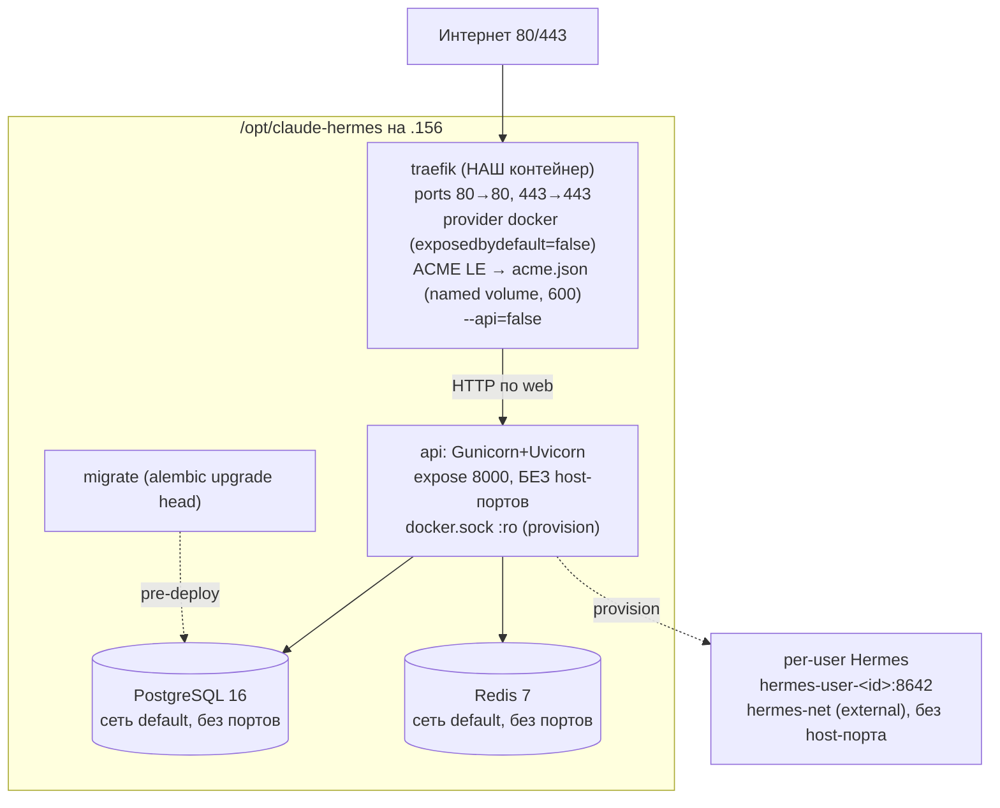

# 07 — Deployment

## Единственный deploy-target claude-hermes (ВАЖНО)
`claude-hermes` — **самостоятельный сервис на ВЫДЕЛЕННОМ сервере `87.239.135.156`** (домен `avorelio.shop`, self-hosted Traefik, [ADR-057](adr/ADR-057-dedicated-server-self-hosted-traefik-deploy.md)). Это **ЕДИНСТВЕННЫЙ** deploy-target репозитория: CI-workflow содержит ровно один deploy-job — `deploy-avorelio` (`.156`). Другого контура выкатки нет.

> **Fork-ancestry (справочно, НЕ применяется к деплою claude-hermes).** Репозиторий отпочкован от `claude-ios`. Прежняя shared-топология [ADR-017](adr/ADR-017-shared-server-traefik-deploy.md) (общий сервер `87.239.135.154` за **внешним** edge-Traefik `/opt/edge`) и её `INSTANCES`-loop (мульти-инстанс-цикл, деплоивший **другие** сервисы) **удалены из CI этого репозитория** (см. [ADR-017 §Ревизия 2026-07-15](adr/ADR-017-shared-server-traefik-deploy.md#ревизия-2026-07-15--для-claude-hermes-применяется-только-выделенный-156-adr-057)). `claude-ios`, `avelyra`, `orvianix`, `veltrio` — **ОТДЕЛЬНЫЕ сервисы** (свои репозитории/хосты/домены `broadnova.shop`/`avelyraweb.shop`/`orvianix.shop`/`veltriohub.shop`), к деплою `claude-hermes` **не относятся** и из этого репозитория **не деплоятся**. Ссылки на ADR-017 в этом документе сохранены там, где переиспользуется **инвариант, не привязанный к серверу** (label-контракт `api`, `/v1/preview/*` pass-through, «build на сервере», роли БД) — но deploy-target всегда только `.156`.

## Артефакт
Один Docker-образ (multi-stage, base `python:3.12-slim`), запускается через Gunicorn + UvicornWorker. Stateless — состояние в PostgreSQL/Redis. Образ **собирается на сервере** из исходников в `/opt/claude-hermes` (на `.156`; явный `docker compose build api migrate`, затем `up -d --no-build` — см. [§Процедура деплоя](#процедура-деплоя-github-actions--ssh-156)), не пушится из registry ([ADR-057](adr/ADR-057-dedicated-server-self-hosted-traefik-deploy.md), схема «build на сервере» унаследована из [ADR-017](adr/ADR-017-shared-server-traefik-deploy.md)).

## Топология — выделенный сервер `.156` avorelio, self-hosted Traefik ([ADR-057](adr/ADR-057-dedicated-server-self-hosted-traefik-deploy.md))
**Единственный** deploy-target `claude-hermes`: **выделенный** Linux-сервер `87.239.135.156` (root), домен `avorelio.shop` (DNS A → `87.239.135.156`), каталог `/opt/claude-hermes`. На этом сервере **нет** внешнего edge-Traefik — reverse-proxy и TLS **наши**: в стек добавляется **наш Traefik-контейнер** (self-hosted), держащий порты 80/443 и авто-выпускающий Let's Encrypt-сертификаты.



**Отличия от унаследованной shared-топологии claude-ios (справочно, [ADR-017](adr/ADR-017-shared-server-traefik-deploy.md) — НЕ deploy-target claude-hermes):**

| | унаследованная shared (claude-ios, ADR-017) | claude-hermes `.156` avorelio |
|---|---|---|
| Reverse-proxy / TLS | **внешний** Traefik `/opt/edge` | **наш** `traefik`-контейнер в compose |
| Порты 80/443 на хост | держит внешний Traefik | держит **наш** `traefik` (единственный сервис с `ports:`) |
| Сеть `web` | `external: true` (общая с чужим Traefik) | **внутренняя** сеть compose (потребитель один — наш Traefik) |
| ACME | внешний Traefik | **наш** Traefik (`certResolver le`, HTTP-01, acme.json в named volume, `ACME_EMAIL`) |
| Домен | `broadnova.shop` и др. сервисы | `avorelio.shop` |
| `TRUSTED_PROXY_IPS` | подсеть внешней `web` | подсеть **нашей** `web` |
| docker.sock читают | `api` (`:ro`) | `traefik` (provider, `:ro`) **И** `api` (`:ro`) |

**Состав стека на `.156`:**
- **traefik** — наш контейнер (`traefik:v3.x` pinned). Единственный с `ports:` (`80:80`, `443:443`). Static-конфиг — **CLI-флаги в `command:`** (не файл `traefik.yml`): `--providers.docker --providers.docker.exposedbydefault=false`, entrypoints `web`(:80)/`websecure`(:443), HTTP→HTTPS redirect, ACME (`--certificatesresolvers.le.acme.email=${ACME_EMAIL}`, `.storage=/letsencrypt/acme.json`, `.httpchallenge.entrypoint=web`), `--api=false` (dashboard выключен). `docker.sock` `:ro` (provider). Сеть `web`. acme.json — в **named volume** `traefik-acme` (`/letsencrypt`), Traefik создаёт его с правами `600`.
- **api** — Traefik-labels из базового `docker-compose.prod.yml` (label-контракт `api` унаследован из [ADR-017](adr/ADR-017-shared-server-traefik-deploy.md), server-agnostic): `Host(${SERVICE_DOMAIN})`=`avorelio.shop`, `entrypoints=websecure`, `tls.certresolver=${TRAEFIK_CERTRESOLVER}`=`le`, `loadbalancer.server.port=8000`; **без** `ports:` (только `expose: 8000`). `docker.sock` `:ro` (provision Hermes, [ADR-046](adr/ADR-046-per-user-hermes-runtime.md)). Сети `web`+`default`+`hermes-net`.
- **postgres**/**redis** — только `default`, без портов.
- **migrate** — одноразовый job (`alembic upgrade head`).
- **Hermes per-user** — провижинятся control plane через `docker.sock` в `hermes-net` ([ADR-046](adr/ADR-046-per-user-hermes-runtime.md), без изменений).

**Сети на `.156`:** `web` — **внутренняя** compose (на выделенном сервере нет внешнего совладельца сети, поэтому НЕ `external` и НЕ требует ручного `docker network create web`); overlay пиннит имя сети к плоскому `web` (`name: web`), чтобы совпал inherited-label `traefik.docker.network=web`; `default` — внутренняя (api↔pg/redis); `hermes-net` — **остаётся `external: true`** (инвариант [ADR-046](adr/ADR-046-per-user-hermes-runtime.md)/[ADR-056](adr/ADR-056-provision-readiness-gate-and-volume-ownership.md): docker-py control plane должен видеть сеть под плоским именем; создаётся `docker network create hermes-net` ДО деплоя). `TRUSTED_PROXY_IPS` = подсеть нашей `web` (`docker network inspect web` → `IPAM.Config.Subnet`).

**TLS (наш Traefik):** certResolver `le`, challenge **HTTP-01** (дефолт для одиночного домена — нужен лишь доступный порт 80 + публичная A-запись; TLS-ALPN-01 — альтернатива; DNS-01 не нужен). Авто-обновление встроено в Traefik. `ACME_EMAIL` обязателен. Первый выпуск требует доступного 80 и валидной A-записи `avorelio.shop` → `.156`.

**Двойственность `docker-compose.prod.yml`** (базовый файл унаследован от claude-ios: `web` `external: true`, `${COMPOSE_PROJECT_NAME:-claude-ios}`, без сервиса `traefik`) разрешена overlay-файлом [`docker-compose.avorelio.yml`](../docker-compose.avorelio.yml) ([Q-057-1](99-open-questions.md) Closed, [ADR-057 §3](adr/ADR-057-dedicated-server-self-hosted-traefik-deploy.md)): overlay добавляет сервис `traefik` + acme-volume и переопределяет `web` явным **`external: false`** (+ `name: web`). Деплой на `.156` — **всегда** `-f docker-compose.prod.yml -f docker-compose.avorelio.yml`. На `.156` в `.env` задаётся `COMPOSE_PROJECT_NAME=claude-hermes` (перекрывает унаследованный дефолт `claude-ios`).

## Reverse-proxy / LB — операционные требования к `/v1/preview/*`
Приложение отдаёт пользовательский (Claude-сгенерированный) HTML/JS на `GET /v1/preview/{projectId}/{token}/{path}` со **своими** sandbox-заголовками (ADR-010, [05-security.md](05-security.md#backend-hosted-preview-отдача-пользовательского-htmljs-adr-010)): `Content-Security-Policy: sandbox ...`, `X-Content-Type-Options: nosniff`, `X-Frame-Options: SAMEORIGIN`, `Cache-Control: private, no-store`, без cookies. Этот путь **исключён** из дефолтных security-заголовков middleware, чтобы отдать собственную политику.

Reverse-proxy / LB (в нашей схеме — **наш self-hosted Traefik** на `.156`) **ОБЯЗАН** на `/v1/preview/*`:
- **не перетирать и не дублировать** заголовки ответа (`Content-Security-Policy`, `X-Frame-Options`, `X-Content-Type-Options`, `Cache-Control`) — pass-through as-is. Не навешивать глобальный `X-Frame-Options: DENY` / общий CSP, применяемый к остальным путям.
- **не добавлять `Set-Cookie`** и не инжектить session/affinity-cookies на этот префикс (превью открывается прямой ссылкой, авторизация — в signed URL, не в cookie).
- глобальные политики безопасности прокси для прочих путей (HSTS, `X-Frame-Options: DENY`) применять **в обход** `/v1/preview/*` (отдельный route/middleware без переопределения заголовков приложения).

> **Self-hosted Traefik на avorelio `.156` ([ADR-057](adr/ADR-057-dedicated-server-self-hosted-traefik-deploy.md)).** Traefik — **наш** контейнер, и контракт pass-through — **наша** конфигурация. Инвариант: глобальные security-header-/cookie-middleware (HSTS, `X-Frame-Options: DENY`, CSP) на `/v1/preview/*` **не навешивать** (перетрут sandbox-`CSP: sandbox`/`X-Frame-Options: SAMEORIGIN`/`Cache-Control`/`X-Content-Type-Options` приложения, ADR-010). Дефолт на старте — глобальный headers-middleware **не добавляется** (приложение само ставит HSTS/`nosniff`/`X-Frame-Options`, [05-security.md §Транспорт](05-security.md#транспорт)), что by construction не трогает preview. HTTP→HTTPS redirect на entrypoint безопасен для preview (только смена схемы запроса, не заголовки ответа). Если позже вводится явный headers-middleware — отдельный router с приоритетом для `PathPrefix(/v1/preview/)` **без** этого middleware.

Прежние Caddy/nginx-артефакты (legacy, DEPRECATED: [`infra/legacy/Caddyfile`](../infra/legacy/Caddyfile), [`infra/legacy/nginx.conf.example`](../infra/legacy/nginx.conf.example)) в этой схеме **не используются** (TLS/reverse-proxy — наш self-hosted Traefik) — перенесены в `infra/legacy/` с DEPRECATED-баннером. См. [§Prod-артефакты](#prod-артефакты-источник-истины--реальные-файлы-в-репозитории).

**Изоляция origin (операционно, [Q-010-3](99-open-questions.md), не блокер):** старт — single-origin `/v1/preview/*` + sandbox-заголовки (самодостаточно). Prod-рекомендация — вынести превью на отдельный поддомен `preview.<domain>`, чтобы даже при обходе CSP пользовательский JS не имел same-origin доступа к API. При вводе поддомена то же требование pass-through заголовков и запрет cookies сохраняется.

## Конфигурация (env)
| Переменная | Назначение |
|---|---|
| `DATABASE_URL` | `postgresql+asyncpg://<POSTGRES_USER>:<POSTGRES_PASSWORD>@postgres:5432/<POSTGRES_DB>` — **собирается из `POSTGRES_USER`/`POSTGRES_PASSWORD`/`POSTGRES_DB` целиком**; все три должны совпадать со значением URL. Runtime-роль `app_rw` ([ADR-053](adr/ADR-053-audit-logs-db-append-only.md), см. [§Роли БД](#роли-бд--durable-append-only-audit_logs-adr-053-prod-harden-td-001)). |
| `POSTGRES_USER` / `POSTGRES_DB` / `POSTGRES_PASSWORD` | креды контейнерного PostgreSQL. `POSTGRES_PASSWORD` — **секрет** (secret manager). Входят в `DATABASE_URL` целиком. На клоне — свои. |
| `KMS_KEY_ID` | идентификатор облачного KMS-ключа. **На MVP пуст** — используется `LocalKmsClient` (in-process AES-256-GCM под `KMS_LOCAL_MASTER_KEY`, облачного KMS нет, [Q-002-1](99-open-questions.md), [ADR-003](adr/ADR-003-byok-envelope-encryption.md)). Заполняется только при миграции на облачный KMS (post-MVP). |
| `REDIS_URL` | `redis://...` |
| `LLM_PROVIDER` | **(провайдер-абстракция, [ADR-033](adr/ADR-033-llm-provider-abstraction.md))** выбор LLM-провайдера для контура `/v1/chat/*`: `anthropic` \| `openai`. **Дефолт `anthropic`** (не задавать на claude-hermes → no-op). Public, не секрет. Независим от `HERMES_LLM_PROVIDER` (LLM внутри Hermes-инстанса, [ADR-055](adr/ADR-055-hermes-instance-llm-config-contract.md)). |
| `ANTHROPIC_API_KEY` | сервисный ключ Claude (mode=credits, **anthropic-инстансы**) |
| `ANTHROPIC_MODEL` | дефолтная модель Claude (= модель по умолчанию для выбора, помечается `default:true` в `GET /v1/models`) |
| `ANTHROPIC_MODELS` | **(выбор модели, [ADR-034](adr/ADR-034-user-model-selection.md))** allowlist моделей Claude для `GET /v1/models` / `chat.model`. JSON-объект `{ "<model-id>": "<displayName>" }` (по образцу `TOKEN_PRODUCTS`). Применяется при `LLM_PROVIDER=anthropic`. **Пусто/невалидно/не задан → фолбэк** на единственную модель `ANTHROPIC_MODEL` (обратная совместимость). Public, не секрет. Per-instance. Пример: `{"claude-sonnet-4-5":"Claude Sonnet 4.5","claude-opus-4-1":"Claude Opus 4.1"}`. |
| `OPENAI_API_KEY` | **(OpenAI, [ADR-033](adr/ADR-033-llm-provider-abstraction.md))** сервисный ключ OpenAI (mode=credits). **СЕКРЕТ**, secret manager, под redaction (покрыт денилистом `key`). Обязателен при `LLM_PROVIDER=openai`. Per-instance (не делить между инстансами). |
| `OPENAI_MODEL` | **(OpenAI)** дефолтная модель оркестрации, дефолт **`gpt-4o`**. Chat Completions API, non-streaming. (= модель по умолчанию для выбора, `default:true` в `GET /v1/models` на openai-инстансе). |
| `OPENAI_MODELS` | **(выбор модели, [ADR-034](adr/ADR-034-user-model-selection.md))** allowlist моделей OpenAI для `GET /v1/models` / `chat.model`. JSON-объект `{ "<model-id>": "<displayName>" }`. Применяется при `LLM_PROVIDER=openai`. **Пусто/невалидно/не задан → фолбэк** на единственную модель `OPENAI_MODEL` (обратная совместимость). Public, не секрет. Per-instance. Пример: `{"gpt-4o":"GPT-4o","gpt-4o-mini":"GPT-4o mini"}`. |
| `OPENAI_MAX_TOKENS` | **(OpenAI)** output-бюджет на вызов, дефолт `16000` (паритет с `ANTHROPIC_MAX_TOKENS`). |
| `OPENAI_TIMEOUT_SECONDS` | **(OpenAI)** таймаут upstream-вызова, дефолт `120`. |
| `OPENAI_MAX_RETRIES` | **(OpenAI)** число ретраев SDK, дефолт `2`. |
| `OPENAI_BYOK_DEFAULT_MODEL` | **(OpenAI)** активная модель в BYOK-ответе при `keyStatus=valid` (`activeModel`), дефолт `gpt-4o` ([ADR-016](adr/ADR-016-extended-byok-statuses.md)/[ADR-033](adr/ADR-033-llm-provider-abstraction.md)). Отдельно от anthropic `BYOK_DEFAULT_MODEL`. |
| `ANTHROPIC_MAX_TOKENS` | output-бюджет на вызов, дефолт **`16000`** ([ADR-025](adr/ADR-025-parallel-tool-calls-and-max-tokens-truncation.md)); прежний `4096` обрезал генерацию кода/файлов. Non-streaming. **Per-instance** — задать на каждом инстансе. |
| `ANTHROPIC_TIMEOUT_SECONDS` | таймаут upstream-вызова, дефолт **`120`** ([ADR-025](adr/ADR-025-parallel-tool-calls-and-max-tokens-truncation.md), поднят с 60 под длинную генерацию при `max_tokens=16000`). |
| `JWT_ISSUER` / `JWT_AUDIENCE` | issuer/audience выпускаемых и проверяемых JWT. Для встроенного issuer: `JWT_ISSUER=https://avorelio.shop`, `JWT_AUDIENCE=claude-hermes` ([ADR-018](adr/ADR-018-embedded-auth-issuer.md)). |
| `JWT_PRIVATE_KEY` / `JWT_PRIVATE_KEY_PATH` | **СЕКРЕТ** — приватный RS256-ключ подписи (встроенный issuer). PEM-строка с `\n`-экранированием **или** путь к файлу (приоритет у `*_PATH`). Только secret manager / mounted-файл, под redaction. **Должен быть сконфигурирован до публичного запуска** (без него `/v1/auth/*` → `503`). [Q-005-1](99-open-questions.md) Closed ([ADR-018](adr/ADR-018-embedded-auth-issuer.md)). |
| `JWT_PUBLIC_KEY` / `JWT_PUBLIC_KEY_PATH` | публичный RS256-ключ (verify + `/v1/auth/jwks`). PEM-строка (`\n`-экранирование) или файл-путь. Не секрет. |
| `JWT_KID` | идентификатор ключа (`kid` в заголовке JWT / JWKS); задел под ротацию. |
| `JWT_JWKS_URL` | **опционально** — verify-only режим внешнего issuer (Firebase и т.п.). Для встроенного issuer не используется (verify по `JWT_PUBLIC_KEY`). Sign in with Apple реализован **не** через этот режим — см. `APPLE_*` ниже ([ADR-043](adr/ADR-043-sign-in-with-apple.md)). |
| `AUTH_ACCESS_TTL_SECONDS` / `AUTH_REFRESH_TTL_SECONDS` | TTL access-token (дефолт `3600`) / refresh-token (дефолт `2592000`). [ADR-018](adr/ADR-018-embedded-auth-issuer.md). |
| `AUTH_RATE_LIMIT_PER_IP` / `AUTH_JWKS_ENABLED` | rate-limit `/v1/auth/*` per IP (дефолт `10`/min) / видимость `GET /v1/auth/jwks` (дефолт `true`). |
| `KMS_LOCAL_MASTER_KEY` | мастер-ключ для envelope encryption BYOK на MVP (`LocalKmsClient`, реальный AES-256-GCM wrap DEK, [ADR-003](adr/ADR-003-byok-envelope-encryption.md)). Высокоэнтропийный (32 байта base64), **только через secret manager/env на сервере** (`.env` в `/opt/claude-hermes`), под redaction. Миграция на облачный KMS — post-MVP ([Q-002-1](99-open-questions.md)). |
| `APPSTORE_*` | App Store Server API credentials (`APPSTORE_ENVIRONMENT`/`APPSTORE_BUNDLE_ID`/`APPSTORE_ROOT_CERT_DIR`) |
| `APPLE_OIDC_ISSUER` | **(Sign in with Apple, [ADR-043](adr/ADR-043-sign-in-with-apple.md))** ожидаемый `iss` Apple identity token. Дефолт `https://appleid.apple.com`. Не секрет. |
| `APPLE_JWKS_URL` | **(Apple)** JWKS Apple для верификации RS256-подписи. Дефолт `https://appleid.apple.com/auth/keys`. Кэш — общий `JWT_JWKS_CACHE_TTL` (300с). Не секрет. |
| `APPLE_AUDIENCE` | **(Apple)** ожидаемый `aud` = **bundle id** приложения (нативный Sign in with Apple) `claude-hermes`. Пусто → фолбэк на `APPSTORE_BUNDLE_ID`. Оба пусты → `POST /v1/auth/apple` → `503` (not configured). Не секрет. |
| `APPLE_TEST_MODE` | **(Apple)** env-флаг HS256 test-mode для герметичных тестов (образец `STOREKIT_TEST_MODE`). Дефолт `false` (**prod fail-closed**: HS256-токен вне test-mode → `401`). **В prod не включать.** |
| `APPLE_TEST_SECRET` | **(Apple)** общий секрет (HS256) для тестового Apple-токена. Обязателен при `APPLE_TEST_MODE=true` (пусто → test-mode не активируется). Секрет, под redaction. **В prod не задаётся.** |
| `STOREKIT_TEST_MODE` | env-флаг тестовой верификации StoreKit. Дефолт `false` (**prod fail-closed, реальная JWS-верификация**). `true` — принимает HS256-тестовую транзакцию (только e2e/CI). При `true` — WARNING в лог на старте. См. [09-e2e-testing.md §2](09-e2e-testing.md#2-storekit_test_mode--env-gated-режим-тестовой-верификации), [TD-007](100-known-tech-debt.md). |
| `STOREKIT_TEST_SECRET` | общий секрет (HS256) для тестовых транзакций. Обязателен при `STOREKIT_TEST_MODE=true` (пусто → test-mode не активируется). Секрет, под redaction. **В prod не задаётся.** |
| `SUBSCRIPTION_CREDITS_PER_PERIOD` | кредитов на период подписки (grant), дефолт `1000` (ADR-006) |
| `ADMIN_API_SECRET` | изолированный admin-секрет для `X-Admin-Token` (`/v1/admin/*`). Высокоэнтропийный, secret manager. Под redaction. Не задан → admin-API недоступен (всегда `401`). См. [ADR-009](adr/ADR-009-admin-token-auth.md). |
| `ADMIN_API_SECRET_PREV` | предыдущий admin-секрет на grace-период ротации (опц.). Пусто вне ротации. Под redaction. |
| `ADMIN_RATE_LIMIT_PER_MIN` | rate limit `/v1/admin/*` per source IP, дефолт `10`. |
| `PREVIEW_URL_SECRET` | секрет HMAC для preview signed URL (`/v1/preview/*`). Высокоэнтропийный, secret manager, отдельный от прочих. Под redaction. См. [ADR-010](adr/ADR-010-backend-hosted-preview.md). |
| `PREVIEW_URL_TTL_SECONDS` | TTL preview signed URL, дефолт `900` (15 мин). |
| `PREVIEW_MAX_FILE_BYTES` | лимит размера одного файла сайта, дефолт `1048576` (1 MB). |
| `PREVIEW_MAX_PROJECT_BYTES` | лимит суммарного размера проекта, дефолт `10485760` (10 MB). |
| `PREVIEW_MAX_FILES` | лимит числа файлов в проекте, дефолт `200`. |
| `MAX_SERVER_TOOL_ROUNDS` | guard числа последовательных server-side (`site.*`) tool-раундов на message-шаг, дефолт `16` ([ADR-011](adr/ADR-011-server-side-tools.md)). |
| `TOKEN_PRODUCTS` | маппинг consumable-продуктов `productId→credits` (JSON), напр. `{"tokens_1500":1500,"tokens_600":600,"tokens_250":250,"tokens_100":100}`. Источник числа кредитов на покупку токенов (server-side, [ADR-015](adr/ADR-015-consumable-token-iap.md)). |
| `ADAPTY_WEBHOOK_SECRET` | **(Adapty, [ADR-029](adr/ADR-029-adapty-subscription-webhook.md))** статический bearer-секрет для `POST /v1/billing/adapty/webhook` (`Authorization: Bearer <...>`). Высокоэнтропийный (≥ 32 байта), secret manager, **per-instance** (свой на каждый инстанс), отдельный от прочих. Под redaction. **Не задан → эндпоинт `500`** (мис-конфигурация). Задаётся также оператором в **Adapty UI** при настройке вебхука (то же значение). |
| `ADAPTY_PRODUCT_TOKENS` | **(Adapty)** маппинг `vendor_product_id→tokens` (JSON), напр. `{"sub_monthly":1000,"sub_yearly":1000}`. Источник числа кредитов на грант по событию подписки ([ADR-029](adr/ADR-029-adapty-subscription-webhook.md)). Дефолт `{}` (всё идёт через fallback). |
| `ADAPTY_SUBSCRIPTION_TOKENS_GRANT` | **(Adapty)** fallback-число кредитов на грант, если `vendor_product_id` отсутствует в `ADAPTY_PRODUCT_TOKENS`. Целое > 0, дефолт `1000` ([ADR-029](adr/ADR-029-adapty-subscription-webhook.md)). Отдельно от `SUBSCRIPTION_CREDITS_PER_PERIOD` (StoreKit-путь) для независимой калибровки. |
| `BYOK_DEFAULT_MODEL` | активная модель, возвращаемая в BYOK-ответе при `keyStatus=valid` (`activeModel`), напр. `claude-sonnet-4-6` ([ADR-016](adr/ADR-016-extended-byok-statuses.md)). |
| `ATTACHMENT_MAX_BYTES_IMAGE` | лимит размера одного image-вложения inline base64, дефолт `5242880` (5 MB) ([ADR-020](adr/ADR-020-inline-base64-attachments-mvp.md)). |
| `ATTACHMENT_MAX_BYTES_DOCUMENT` | лимит размера одного document-вложения inline base64, дефолт `8388608` (8 MB) ([ADR-020](adr/ADR-020-inline-base64-attachments-mvp.md)). |
| `ATTACHMENT_TOTAL_BYTES` | суммарный лимит размера вложений в одном запросе, дефолт `10485760` (10 MB) ([ADR-020](adr/ADR-020-inline-base64-attachments-mvp.md)). |
| `ATTACHMENT_MAX_COUNT` | макс. число вложений на сообщение, дефолт `10` ([ADR-020](adr/ADR-020-inline-base64-attachments-mvp.md)). |
| `ATTACHMENT_PDF_MAX_PAGES` | guard числа страниц PDF (анти-decompression-bomb, `pypdf`), дефолт `100` ([ADR-020](adr/ADR-020-inline-base64-attachments-mvp.md)). |
| `ATTACHMENT_REQUEST_BODY_LIMIT` | повышенный transport-лимит тела для роута `/v1/chat/run` под inline base64, дефолт `12582912` (12 MB) ([ADR-020](adr/ADR-020-inline-base64-attachments-mvp.md), [05-security.md](05-security.md#повышенный-transport-лимит-для-v1chatrun-inline-base64-вложения-adr-020)). |
| `ATTACHMENT_EXTRACT_MAX_CHARS`, `ATTACHMENT_ORPHAN_TTL` | **не задаются на MVP** — относятся к отложенной двухшаговой upload-модели attachments ([TD-015](100-known-tech-debt.md), транспорт [ADR-014](adr/ADR-014-multimodal-attachments.md) Superseded). Orphan-очистка — [TD-010](100-known-tech-debt.md). |
| `WORKSPACE_CONTEXT_MAX_CHARS` | лимит суммарного контекста workspace-файлов, инжектируемого в prompt, дефолт `200000` ([ADR-013](adr/ADR-013-workspace-projects-vs-website-builder.md), [Q-013-1](99-open-questions.md)). |
| `CHAT_TITLE_MAX_CHARS` | макс. длина автогенерируемого заголовка чата, дефолт `60` (модуль chats). |
| `APNS_*` | credentials APNs для отправки push (`APNS_KEY_ID`/`APNS_TEAM_ID`/`APNS_AUTH_KEY`/`APNS_TOPIC`). **Не задаются в этом проходе** — отправка push отложена ([TD-011](100-known-tech-debt.md)). |
| `RATE_LIMIT_*` | значения rate limits |
| `SIZE_LIMIT_*` | size-лимиты payload |
| `TRUSTED_PROXY_IPS` | comma-separated список IP/CIDR доверенных reverse-proxy/LB. Дефолт `""` → XFF/X-Real-IP не доверяются, используется socket peer IP. **В prod ОБЯЗАН** содержать адрес/подсеть **нашего self-hosted Traefik** (`.156`) — подсеть docker-сети `web` (через неё Traefik проксирует на `api`). Иначе `client_ip` берётся как IP Traefik, и per-IP rate limit неработоспособен ([ADR-057](adr/ADR-057-dedicated-server-self-hosted-traefik-deploy.md), [05-security.md](05-security.md#доверенный-reverse-proxy-и-определение-client-ip-anti-spoofing)). Подсеть `web` — `docker network inspect web` (поле `IPAM.Config.Subnet`) на сервере; для bridge-сети по умолчанию вида `172.x.0.0/16`. |
| `TRUSTED_PROXY_HOP_COUNT` | число доверенных proxy-хопов перед приложением (chained LB/CDN). Дефолт `1`. Client IP берётся `(hop_count + 1)`-м справа из `X-Forwarded-For`. |
| `DB_POOL_SIZE` | размер пула соединений БД на процесс. Дефолт `10`. |
| `DB_MAX_OVERFLOW` | доп. соединения сверх `DB_POOL_SIZE` под пик. Дефолт `5`. |
| `DB_POOL_TIMEOUT` | таймаут ожидания соединения из пула, сек. Дефолт `30`. |
| `DB_POOL_RECYCLE` | принудительный recycle соединения, сек (борьба с idle-timeout на стороне PG/proxy). Дефолт `1800`. |
| `METRICS_SCRAPE_TOKEN` | если задан — `GET /metrics` требует заголовок `X-Scrape-Token` с этим значением (иначе 403). Пусто → endpoint открыт, защищать сетевой политикой. |
| `COMPOSE_PROJECT_NAME` | имя docker-compose project. Подставляется как `${COMPOSE_PROJECT_NAME:-claude-ios}` в image-теги (`<proj>-backend:prod`) и Traefik router/service-имена. **Дефолт `claude-ios`** унаследован из базового `docker-compose.prod.yml` (fork claude-ios, backward-compat) — на `.156` **задаётся `COMPOSE_PROJECT_NAME=claude-hermes`** в `.env` (перекрывает дефолт), деплой — с `-p claude-hermes` (совпадает с basename `/opt/claude-hermes`). Public, не секрет. |
| `SERVICE_DOMAIN` | домен сервиса. **Две роли:** (1) Traefik Host-роутер (label `Host(`avorelio.shop`)`) + ACME-сертификат ([ADR-057](adr/ADR-057-dedicated-server-self-hosted-traefik-deploy.md)); (2) **с [ADR-031](adr/ADR-031-absolute-preview-url.md) читается и самим приложением** (`config.py` `service_domain`) для построения **абсолютного** preview-URL в `site.preview` (`https://<SERVICE_DOMAIN>/v1/preview/...`). Значение нормализуется приложением (срез протокола/хвостового слеша). **Значение: `avorelio.shop`**; A-запись → `87.239.135.156` до запуска. Пусто (локальная разработка) → `site.preview` отдаёт относительный путь (fallback). TLS/ACME выпускает **наш** Traefik-контейнер. PUBLIC, не секрет. |
| `TRAEFIK_CERTRESOLVER` | имя ACME-certresolver для label `tls.certresolver`. **Значение: `le`** — резолвер **нашего** Traefik-контейнера на `.156` ([ADR-057](adr/ADR-057-dedicated-server-self-hosted-traefik-deploy.md), объявлен в его static-конфиге `--certificatesresolvers.le.*`). Label на `api` унаследован из базового compose (server-agnostic label-контракт [ADR-017](adr/ADR-017-shared-server-traefik-deploy.md)). PUBLIC, не секрет. |
| `ACME_EMAIL` | **(self-hosted Traefik, [ADR-057](adr/ADR-057-dedicated-server-self-hosted-traefik-deploy.md))** email для ACME Let's Encrypt **нашего** Traefik-контейнера (уведомления об истечении). Флаг `--certificatesresolvers.le.acme.email=${ACME_EMAIL}` в overlay `docker-compose.avorelio.yml`. **Обязателен** — пусто → Traefik fail-fast на старте (подстановка `:?`). PUBLIC, не секрет. |
| `OTEL_EXPORTER_OTLP_ENDPOINT` | трейсы |
| `LOG_LEVEL` | уровень логирования |
| `CLIENT_API_KEY` | **(Hermes-интеграция, [ADR-044](adr/ADR-044-client-api-key-auth.md))** единый клиентский ключ для `X-API-Key` (авторизация всех `/v1/*` клиентского контура). Высокоэнтропийный (≥32 байта), **СЕКРЕТ**, secret manager, под redaction. Не задан → клиентский контур недоступен (всегда `401`). Per-instance. |
| `CLIENT_API_KEY_PREV` | **(Hermes-интеграция, [ADR-044](adr/ADR-044-client-api-key-auth.md))** предыдущий клиентский ключ на grace-период ротации (опц.). Пусто вне ротации. Секрет, под redaction. |
| `HERMES_IMAGE` | **(Hermes runtime, [ADR-046](adr/ADR-046-per-user-hermes-runtime.md))** **публичный образ Hermes из registry** (pull по pinned-тегу/digest, **не `latest`**), напр. `nousresearch/hermes-agent:<pinned-tag>` (или `nousresearch/hermes-agent@sha256:...`). **Требование самодостаточности: образ тянется ИСКЛЮЧИТЕЛЬНО из публичного registry — сборки из внешних исходников Hermes на сервере нет** (на сервер деплоится только этот репозиторий; docker-py `containers.run(image=...)` авто-pull'ит при отсутствии). Per-instance. Фиксированный тег/digest для воспроизводимости. Предусловие: образ должен быть pullable на хосте daemon (`docker pull <ref>`) до первого `/v1/agent/*` или предзагружен. **Дефолт `''` (пусто) → fail-fast: `provision` без заданного образа невозможен** (явная мис-конфигурация, а не молчаливый `latest`). |
| `HERMES_DOCKER_NETWORK` | **(Hermes runtime)** имя выделенной docker-сети control plane↔инстансы. Инстансы НЕ публикуют порт на хост — доступ только из этой сети; адресация по DNS контейнера (`hermes-user-<id>:8642`). **Дефолт `hermes-net`.** Создаётся на сервере однократно (`docker network create hermes-net`). |
| `HERMES_VOLUME_ROOT` | **(Hermes runtime)** корневой путь на хосте для томов `HERMES_HOME` пользователей (`/opt/data` инстанса). Том на пользователя, сохраняется при гибернации. **Дефолт `/opt/data/hermes`** — корректен на выделенном `.156` (единственный control plane на daemon, [ADR-057 §7](adr/ADR-057-dedicated-server-self-hosted-traefik-deploy.md), [Q-046-3](99-open-questions.md)). |
| `HERMES_DEFAULT_TOOLSET` | **(Hermes runtime, [05-security.md](05-security.md#multi-tenant-изоляция-hermes-инстансов-adr-046-adr-045))** безопасный набор инструментов для `config.yaml` инстанса (`platform_toolsets.api_server`), дефолт `[web, file, vision, skills, todo]` (БЕЗ terminal/browser/code_execution/computer_use). Конфигурируем (задел под тарифы). |
| `HERMES_IDLE_TIMEOUT_SECONDS` | **(Hermes runtime)** порог гибернации: контейнер с `last_active_at` старше — останавливается фоновым reaper (`stop_idle`). Будится по запросу. **Дефолт `1800`** (30 мин). |
| `HERMES_REAPER_INTERVAL_SECONDS` | **(Hermes runtime)** интервал тика фонового reaper в `lifespan` (как часто проверяются idle-инстансы). Отделён от `HERMES_IDLE_TIMEOUT_SECONDS` (порог гибернации). **Дефолт `300`** (5 мин). |
| `HERMES_LLM_PROVIDER` | **(Hermes runtime, [ADR-055](adr/ADR-055-hermes-instance-llm-config-contract.md))** провайдер LLM **внутри** инстанса → пишется в `config.yaml` `model.provider` (НЕ env). Независим от нашего `LLM_PROVIDER` ([ADR-033](adr/ADR-033-llm-provider-abstraction.md)). **КОНКРЕТНЫЙ** провайдер из allowlist образа (`anthropic`, `openrouter`, `gemini`, `nous-api`, `zai`, `kimi-coding`, `huggingface`, `nvidia`, `xiaomi`, `arcee`, `minimax`, `minimax-cn`, `ollama-cloud`, `kilocode`, `azure-foundry`, `lmstudio`, `custom`, …). **`openai` — НЕВАЛИДЕН** (нет direct-провайдера; OpenAI → через `openrouter` или `custom`). **`auto` запрещён** (дефолтит на openrouter base_url → 401). Невалидное значение → провижининг **fail-fast** (не 401 в рантайме). **Дефолт `anthropic`.** |
| `HERMES_LLM_API_KEY` | **(Hermes runtime, [ADR-055](adr/ADR-055-hermes-instance-llm-config-contract.md))** сервисный ключ LLM-провайдера инстанса. **СЕКРЕТ**, secret manager, под redaction. **Канал зависит от провайдера:** для провайдеров **с env-ключом** (`anthropic`, `openrouter`, `gemini`, …) — прокидывается как `<PROVIDER>_API_KEY` по map провайдер→key-env (`anthropic→ANTHROPIC_API_KEY`, `openrouter→OPENROUTER_API_KEY`, `gemini→GOOGLE_API_KEY`, `huggingface→HF_TOKEN`, `zai→GLM_API_KEY`, `kimi-coding→KIMI_API_KEY`, `nous-api→NOUS_API_KEY`, `nvidia→NVIDIA_API_KEY`, … — таблица в [ADR-055 §4](adr/ADR-055-hermes-instance-llm-config-contract.md)); для провайдеров **без env-ключа** (`custom` ∈ `HERMES_PROVIDERS_CONFIG_API_KEY`, [ADR-055 §6](adr/ADR-055-hermes-instance-llm-config-contract.md)) — прокидывается как env `HERMES_INSTANCE_LLM_KEY` и эмитится в `config.yaml model.api_key="${HERMES_INSTANCE_LLM_KEY}"` (env-ссылка, плейнтекст не в файле тома; `<PROVIDER>_API_KEY` НЕ передаётся — образ его игнорирует). Ключ **обязан соответствовать `HERMES_LLM_PROVIDER`**. Пусто → fail-fast. |
| `HERMES_MODEL` | **(Hermes runtime, [ADR-055](adr/ADR-055-hermes-instance-llm-config-contract.md))** **«голое» имя модели** инстанса (напр. `claude-3-5-haiku-latest`), **БЕЗ префикса провайдера**. Control plane собирает `config.yaml model.default = "<HERMES_LLM_PROVIDER>/<HERMES_MODEL>"`. **env `LLM_MODEL` инстансу НЕ передаётся** (образ её игнорирует — модель только из `config.yaml`). **Обязателен и непуст** — пусто → провижининг fail-fast (пустая модель = тот самый баг «Model: (пусто)» → 401). |
| `HERMES_LLM_BASE_URL` | **(Hermes runtime, [ADR-055](adr/ADR-055-hermes-instance-llm-config-contract.md))** base_url LLM-эндпоинта → `config.yaml` `model.base_url`. **Обязателен** для провайдеров `custom`/`azure-foundry` (опционален для `lmstudio`); для остальных (`anthropic`/`openrouter`/`gemini`/…) — оставить пустым (строка `base_url` не эмитится, образ подставляет провайдер-дефолт). Пусто при провайдере, требующем base_url → fail-fast. |
| `HERMES_API_KEY_BYTES` | **(Hermes runtime)** длина генерируемого `API_SERVER_KEY` инстанса в байтах (CSPRNG, ≥16 символов после кодирования — [ADR-046](adr/ADR-046-per-user-hermes-runtime.md)). Операционный. Дефолт — см. backend-конфиг (`src/app/config.py`); должен давать ключ ≥16 символов. |
| `HERMES_HEALTH_TIMEOUT_SECONDS` | **(Hermes runtime)** таймаут health-пробинга инстанса (`health(user_id)` → `GET /health` контейнера). Операционный; по истечении — инстанс считается недоступным (`502` на `/v1/agent/*`, [ADR-045 §6](adr/ADR-045-hermes-as-agent-proxy.md)). |
| `CREDITS_PER_1K_INPUT` / `CREDITS_PER_1K_OUTPUT` | **(биллинг агента, [ADR-047](adr/ADR-047-usage-based-billing-for-agent.md))** коэффициенты конвертации usage→кредиты для `/v1/agent/*`: кредитов за 1000 input / output токенов. `amount=ceil(in/1000*K_in + out/1000*K_out)`, мин. 1 при ненулевом usage. Калибруются по себестоимости провайдера до приёма трафика ([Q-047-1](99-open-questions.md)). |
| `AGENT_DEBT_RECONCILE_ENABLED` | **(prod-harden, [ADR-051](adr/ADR-051-agent-debt-reconciliation.md))** включает реконсиляцию несписанной дельты агентного прогона: частичное списание `balance` + недобор → `wallets.debt`, clawback при пополнении, policy-блок `debt_outstanding` при `debt>0`. **Дефолт `true`.** При `false` — поведение [ADR-047 §6](adr/ADR-047-usage-based-billing-for-agent.md) (только audit `billing_debit_insufficient`). Колонка `wallets.debt` создаётся миграцией `0014` независимо от флага. |
| `HERMES_PROVISIONING_STALE_SECONDS` | **(prod-harden, Hermes runtime, [TD-031](100-known-tech-debt.md))** порог возраста, после которого строка `hermes_instances` в статусе `provisioning` трактуется `ensure_running` как stale → `deprovision`+`provision` (реплей) вместо использования неполной строки. **Дефолт `120`** (сек). **Инвариант ([ADR-056](adr/ADR-056-provision-readiness-gate-and-volume-ownership.md)): должен быть СТРОГО больше `HERMES_PROVISION_READY_TIMEOUT_SECONDS`** (иначе живой readiness-wait будет ошибочно признан stale и реплеен) — валидируется fail-fast в `config.py`. |
| `HERMES_PROVISION_READY_TIMEOUT_SECONDS` | **(Hermes runtime, [ADR-056](adr/ADR-056-provision-readiness-gate-and-volume-ownership.md))** бюджет ожидания готовности инстанса после `docker run`: `_provision_locked` поллит `GET /health` (Bearer) до `200` ПЕРЕД `mark_running` (cold-start образа ~30–40 с). По истечении → cleanup контейнера + `502` (не помечать `running` на неготовом контейнере). **Дефолт `90`** (сек; > штатного cold-start, < `HERMES_PROVISIONING_STALE_SECONDS`). |
| `HERMES_PROVISION_READY_INTERVAL_SECONDS` | **(Hermes runtime, [ADR-056](adr/ADR-056-provision-readiness-gate-and-volume-ownership.md))** интервал между health-пробами в readiness-poll провижининга. **Дефолт `2`** (сек). Каждая проба — под `HERMES_HEALTH_TIMEOUT_SECONDS`. |
| `HERMES_UID` | **(Hermes runtime, [ADR-056 §4](adr/ADR-056-provision-readiness-gate-and-volume-ownership.md))** UID, передаваемый Hermes-контейнеру как env `HERMES_UID` — s6 stage2 образа `usermod`+`chown /opt/data` на этот UID. **Должен совпадать с uid api-контейнера**, который пишет `config.yaml` в том (иначе `PermissionError(13)` при reuse-`provision`). **Дефолт `10001`** (uid non-root пользователя `api`). Не секрет. |
| `HERMES_GID` | **(Hermes runtime, [ADR-056 §4](adr/ADR-056-provision-readiness-gate-and-volume-ownership.md))** GID, передаваемый Hermes-контейнеру как env `HERMES_GID` (s6 stage2 `groupmod`+`chown`). **Должен совпадать с gid api-контейнера.** **Дефолт `10001`.** Не секрет. |
| `AUTH_REFRESH_CLEANUP_INTERVAL_SECONDS` | **(prod-harden, [TD-013](100-known-tech-debt.md))** интервал фоновой очистки `auth_refresh_tokens` (переиспользует reaper-паттерн в `lifespan`). **Дефолт `3600`** (1 час). |
| `AUTH_REFRESH_CLEANUP_GRACE_SECONDS` | **(prod-harden, [TD-013](100-known-tech-debt.md))** grace-период: использованные/отозванные refresh-строки удаляются, только если `COALESCE(used_at,revoked_at)` старше этого порога (сохранить недавно-ротированные для reuse-детекта). **Дефолт `604800`** (7 дней). |
| `DATABASE_URL` (runtime — роль `app_rw`) / `DATABASE_URL_MIGRATE` (роль `app_migrate`) | **(prod-harden, [ADR-053](adr/ADR-053-audit-logs-db-append-only.md))** для durable append-only `audit_logs` runtime и миграции **обязаны** ходить под РАЗНЫМИ ролями БД: `app_rw` (least-privilege: `INSERT,SELECT` на `audit_logs`, без `UPDATE,DELETE,TRUNCATE`) и `app_migrate` (полные права для DDL/откатов, включая `CREATE ON DATABASE` для расширений). `migrations/env.py` берёт `DATABASE_URL_MIGRATE` с **fallback на `DATABASE_URL`** (приоритет Alembic Config для e2e/testcontainers сохранён — см. §Миграции). См. §Роли БД ниже. До разведения REVOKE на единственной роли заблокирует миграции `audit_logs`. |
| `APP_RW_PASSWORD` / `APP_MIGRATE_PASSWORD` | **(prod-harden, [ADR-053](adr/ADR-053-audit-logs-db-append-only.md))** пароли ролей `app_rw`/`app_migrate`; читаются init-скриптом [`docker/postgres/init/01-roles.sh`](../docker/postgres/init/01-roles.sh) при создании ролей на свежем томе и должны совпадать с паролями в `DATABASE_URL`/`DATABASE_URL_MIGRATE`. **Секреты** (secret manager в prod; плейсхолдеры в `.env.example`/`.env.prod.example`). |
| `DOCS_ENABLED` | вкл/выкл OpenAPI-документацию (`/docs`, `/redoc`, `/openapi.json`). Дефолт `true` (dev/CI/staging). В prod рекомендуется `false` — не раскрывать схему API публично; при `false` эти пути отдают `404`. См. [08-api-documentation.md](08-api-documentation.md#r7-доступность-docs-в-prod-env-флаг). |

Все секреты — из secret manager, не из plaintext `.env` в prod.

## Hermes runtime — деплой per-user инстансов ([ADR-046](adr/ADR-046-per-user-hermes-runtime.md), [ADR-045](adr/ADR-045-hermes-as-agent-proxy.md))
Control plane (`api`) управляет персональными Hermes-инстансами (Docker-контейнер + том на пользователя). Операционные требования (deploy-target `.156` avorelio, [ADR-057](adr/ADR-057-dedicated-server-self-hosted-traefik-deploy.md); инварианты runtime — [ADR-046](adr/ADR-046-per-user-hermes-runtime.md)/[ADR-056](adr/ADR-056-provision-readiness-gate-and-volume-ownership.md)):

- **Доступ control plane к Docker daemon (решение Спринта 5).** `api`-контейнеру control plane нужен доступ к Docker daemon для `docker run/start/stop/remove/inspect` инстансов через docker-py ([ADR-046](adr/ADR-046-per-user-hermes-runtime.md)). Зафиксированы два пути:
  - **Основной — смонтированный docker.sock в режиме `:ro`, только в `api`.** В `docker-compose.prod.yml` сервис `api` монтирует `/var/run/docker.sock:/var/run/docker.sock:ro`. Монтируется **только** в `api` control plane — **не** в Hermes-инстансы, не в `postgres`/`redis`. Контейнер `api` работает под **non-root uid 10001** (без рутового пользователя внутри контейнера). Доступ к группе docker для uid 10001 на чтение сокета — операционная настройка хоста (GID docker-группы).
  - **Альтернатива — remote TLS Docker API.** Удалённый Docker API по TLS с **обязательной взаимной проверкой сертификатов** (`DOCKER_HOST=tcp://…`, `DOCKER_TLS_VERIFY=1`, `DOCKER_CERT_PATH`). **Отключение TLS verify запрещено** (`DOCKER_TLS_VERIFY` не снимать; не использовать незащищённый `tcp://` без TLS). Выбор основного пути vs remote — операционный.
  - ⚠️ **Риск и митигация.** Доступ к Docker daemon ≈ root на хосте даже при `:ro`-сокете (read-only ограничивает запись в файл сокета, но **не** ограничивает Docker API — через него по-прежнему можно запускать привилегированные контейнеры). Это повышенная привилегия ([05-security.md §Multi-tenant изоляция](05-security.md#multi-tenant-изоляция-hermes-инстансов-adr-046-adr-045)). Митигация: сокет только в `api` (минимизация поверхности), non-root uid 10001 внутри `api`, docker.sock НЕ пробрасывается в Hermes-инстансы (toolset инстанса не включает `terminal`/`code_execution` — [ADR-046](adr/ADR-046-per-user-hermes-runtime.md)/[05-security.md](05-security.md#multi-tenant-изоляция-hermes-инстансов-adr-046-adr-045)); на выделенном `.156` соседних чужих сервисов нет — поверхность меньше. Усиление (rootless Docker / socket-proxy с allowlist Docker API) — операционный задел.
- **Выделенная docker-сеть** `HERMES_DOCKER_NETWORK` (дефолт `hermes-net`, отдельная от `web`/`default`): control plane ↔ Hermes-инстансы. В `docker-compose.prod.yml` сеть объявлена как **`external: true`** — compose **не создаёт** её, а ссылается на уже существующую; поэтому сеть **обязана быть создана на сервере ДО деплоя** control plane (`docker network create hermes-net`) — иначе `docker compose up` падает с ошибкой отсутствующей external-сети. Инстансы подключаются к ней при провижининге; **порт `8642` НЕ публикуется на хост** (`expose` внутри сети, без `ports:`). Адресация — по DNS-имени контейнера (`hermes-user-<id>:8642`). См. предзапусковый шаг в [prod-checklist](#prod-readiness-checklist-must-configure-before-launch).
- **Том-рут `HERMES_VOLUME_ROOT`** на хосте — корень для томов `HERMES_HOME` (`/opt/data` каждого инстанса). Том на пользователя (приватные память/навыки/сессии), сохраняется при гибернации (`stop_idle`). Бэкап томов (как `pg_dump`) — операционное требование при наличии ценных пользовательских данных агента.
- **Образ Hermes `HERMES_IMAGE` — публичный образ из registry (требование самодостаточности).** Образ Hermes тянется **исключительно** из публичного registry по **pinned-тегу/digest** (`nousresearch/hermes-agent:<pinned-tag>` или `...@sha256:...`, **не `latest`**). **Сборки из внешних исходников Hermes на сервере нет**: этот сервис (`claude-hermes`) самодостаточен — на сервер деплоится только данный репозиторий, а runtime-образ инстансов pull'ится из registry (`docker pull <ref>` как предусловие/предзагрузка, либо авто-pull docker-py при `provision`). **Зафиксировать тег/digest** для воспроизводимости. Per-instance.
- **Гибернация / reaper:** фоновый reaper в `lifespan` control plane вызывает `stop_idle` каждые `HERMES_REAPER_INTERVAL_SECONDS` (дефолт 300с), останавливая контейнеры с простоем дольше `HERMES_IDLE_TIMEOUT_SECONDS` (дефолт 1800с). Состояние инстансов — в `hermes_instances` (переживает рестарт `api`). Cold start при пробуждении остановленного контейнера — ожидаемая латентность первого запроса после простоя.
- **Cold-start readiness-gate ([ADR-056](adr/ADR-056-provision-readiness-gate-and-volume-ownership.md)):** образ Hermes (~5.3 GB) бутится ~30–40 с (s6 stage2 + запуск `api_server`). Control plane после `docker run` **поллит `GET /health` инстанса до `200`** (бюджет `HERMES_PROVISION_READY_TIMEOUT_SECONDS`=90с, интервал `HERMES_PROVISION_READY_INTERVAL_SECONDS`=2с) ПЕРЕД тем как пометить инстанс `running` и проксировать. Таймаут → cleanup контейнера + `502` (не «быстрый `502` в неготовый инстанс», а либо медленный успех, либо чистый отказ). Инвариант: `HERMES_PROVISIONING_STALE_SECONDS`(120) > `HERMES_PROVISION_READY_TIMEOUT_SECONDS`(90).
- **Владение томом — `HERMES_UID`/`HERMES_GID` ([ADR-056 §4](adr/ADR-056-provision-readiness-gate-and-volume-ownership.md)):** Hermes-образ при старте (s6 stage2) `chown`'ит `/opt/data` (= host-том) на свой `HERMES_UID` (дефолт образа 10000). Control plane (api, **uid 10001**) пишет в том `config.yaml`. Чтобы владелец тома совпал с пишущим процессом, control plane прокидывает Hermes env **`HERMES_UID`/`HERMES_GID`=10001** (= uid/gid api-контейнера). **Обязательно держать `HERMES_UID`/`HERMES_GID` синхронными с фактическим uid/gid `api`-сервиса в `docker-compose`** — рассинхрон вернёт `PermissionError(13)` при reuse-`provision`. Дополнительно: `config.yaml` пишется идемпотентно (валидный существующий не перезаписывается при reuse).
- **Health / rollback:** прокси `/v1/agent/*` зависит от доступности инстанса (`health(user_id)`); при недоступности — `502` ([ADR-045 §6](adr/ADR-045-hermes-as-agent-proxy.md)). Rollback образа Hermes — смена `HERMES_IMAGE` тега + пересоздание инстансов (`deprovision`/`provision`); том сохраняется.
- **Одиночный control plane на выделенном `.156` ([ADR-057 §7](adr/ADR-057-dedicated-server-self-hosted-traefik-deploy.md)):** `claude-hermes` — **единственный** control plane на своём Docker daemon, поэтому дефолты `HERMES_DOCKER_NETWORK=hermes-net` + `HERMES_VOLUME_ROOT=/opt/data/hermes` корректны без per-instance-префиксов (коллизии возникали бы только при нескольких control plane на одном daemon — не наш случай). Hermes-контейнеры (`hermes-user-<id>`) на `.156` изолированы от любых других хостов.

## Роли БД — durable append-only `audit_logs` ([ADR-053](adr/ADR-053-audit-logs-db-append-only.md), prod-harden, [TD-001](100-known-tech-debt.md))
Для durable-неизменяемости аудита на уровне БД (не только приложения) **runtime и миграции ходят под разными ролями**:

- **`app_rw` (runtime-роль `api`-контейнера, `DATABASE_URL`)** — least-privilege: обычные права на пользовательские таблицы, но на `audit_logs` — **`GRANT INSERT, SELECT`** и **`REVOKE UPDATE, DELETE, TRUNCATE`**. НЕ владелец схемы, НЕ суперюзер.
- **`app_migrate` (миграционная роль, `DATABASE_URL_MIGRATE`)** — полные права (DDL, в т.ч. правки/откаты схемы `audit_logs`, отключение триггера для операционных процедур). Используется **только** job'ом миграций (`run --rm migrate`), не runtime-процессом.
- Миграция `0016` ([ADR-053](adr/ADR-053-audit-logs-db-append-only.md)) выполняет `REVOKE ... FROM app_rw` + `GRANT INSERT,SELECT TO app_rw` и создаёт BEFORE-триггер `audit_logs_no_mutate()` (запрет UPDATE/DELETE для любой роли). Применяется под `app_migrate` (через `DATABASE_URL_MIGRATE`). Роли (`CREATE ROLE app_rw/app_migrate`, GRANT на остальные таблицы) — **devops** (вне миграции; провижининг БД), т.к. требуют привилегий уровня кластера/владельца. **Реализовано (devops):** init-скрипт [`docker/postgres/init/01-roles.sh`](../docker/postgres/init/01-roles.sh) (свежий том: локалка/e2e/новый prod-инстанс) + ручная `CREATE ROLE`-процедура (существующий prod-том) — см. §Как создаются роли ниже.
- **Разрешение DSN в `migrations/env.py` (реализовано):** Alembic `context.config` > `DATABASE_URL_MIGRATE` (`app_migrate`) > `DATABASE_URL` (`app_rw`, fallback). Приоритет Alembic Config для e2e/testcontainers сохранён ([TD-008](100-known-tech-debt.md)). Runtime (`api`) — всегда `DATABASE_URL` (`app_rw`). Детали — §Миграции.
- ⚠️ **Порядок (devops):** роли `app_rw`/`app_migrate` и раздельные DSN **обязаны** существовать ДО применения миграции `0016` — иначе `REVOKE FROM app_rw` упадёт (нет роли) или REVOKE на единственной общей роли заблокирует последующие миграции `audit_logs`. Erasure аудита (GDPR) — out-of-band под `app_migrate` с `ALTER TABLE audit_logs DISABLE TRIGGER ...`.

### Как создаются роли (devops, вне миграции)
Роли провижинит devops двумя путями в зависимости от того, **пуст ли том данных**:

**1. Init-скрипт (свежий том) — локалка / e2e / новый prod-инстанс.**
[`docker/postgres/init/01-roles.sh`](../docker/postgres/init/01-roles.sh) монтируется в `postgres` как `/docker-entrypoint-initdb.d/01-roles.sh` (см. `docker-compose.yml`, `docker-compose.prod.yml`). Идемпотентно создаёт `app_rw`/`app_migrate` (guarded `CREATE ROLE` через `pg_roles`), выдаёт `CONNECT` + `USAGE` на `public` обоим, `app_migrate` — `CREATE ON DATABASE` (нужно для `CREATE EXTENSION pgcrypto` в миграции `0001`) + `CREATE ON SCHEMA public` + полные права (DDL) и `ALTER DEFAULT PRIVILEGES`, чтобы будущие таблицы автоматически были доступны `app_rw` (базовый DML). **Пер-табличный REVOKE на `audit_logs` НЕ здесь** — его делает миграция `0016` (сужает `audit_logs` до `INSERT,SELECT`). Пароли ролей берутся из env-переменных `APP_RW_PASSWORD`/`APP_MIGRATE_PASSWORD` (secret manager в prod; плейсхолдеры в `.env.example`/`.env.prod.example`).
- ⚠️ **Init-скрипты Postgres выполняются ТОЛЬКО при первой инициализации ПУСТОГО тома** (`/var/lib/postgresql/data`). На уже наполненном томе скрипт не запускается.
- e2e (`docker-compose.yml` + `docker-compose.e2e.yml`): override снимает только публикацию портов (`ports: !reset []`), `postgres` наследует от base монтирование init-скрипта и `APP_*_PASSWORD` — роли создаются как обычно при свежем томе.

**2. Ручная процедура (существующий prod-том с данными).**
Если prod-БД уже содержит данные (том не пуст), init-скрипт **не сработает** — роли заводятся вручную ОДИН РАЗ на сервере, под суперюзером (`POSTGRES_USER`), ДО применения миграции `0016`:

```sql
-- На сервере: docker compose -p <instance> -f docker-compose.prod.yml --env-file .env \
--   exec postgres psql -U "$POSTGRES_USER" -d "$POSTGRES_DB"
-- Пароли подставить из secret manager (= APP_RW_PASSWORD / APP_MIGRATE_PASSWORD в .env,
-- те же, что в DATABASE_URL / DATABASE_URL_MIGRATE). НЕ коммитить реальные значения.
DO $$ BEGIN
  IF NOT EXISTS (SELECT FROM pg_roles WHERE rolname='app_rw') THEN
    CREATE ROLE app_rw LOGIN PASSWORD '<APP_RW_PASSWORD>';
  END IF;
  IF NOT EXISTS (SELECT FROM pg_roles WHERE rolname='app_migrate') THEN
    CREATE ROLE app_migrate LOGIN PASSWORD '<APP_MIGRATE_PASSWORD>';
  END IF;
END $$;

GRANT CONNECT ON DATABASE <POSTGRES_DB> TO app_rw, app_migrate;
-- CREATE на БД нужен app_migrate для CREATE EXTENSION (миграция 0001: pgcrypto). app_rw — НЕ даём.
GRANT CREATE ON DATABASE <POSTGRES_DB> TO app_migrate;
GRANT USAGE ON SCHEMA public TO app_rw;
GRANT USAGE, CREATE ON SCHEMA public TO app_migrate;
GRANT ALL PRIVILEGES ON ALL TABLES IN SCHEMA public TO app_migrate;
GRANT ALL PRIVILEGES ON ALL SEQUENCES IN SCHEMA public TO app_migrate;
ALTER DEFAULT PRIVILEGES IN SCHEMA public GRANT ALL ON TABLES TO app_migrate;
-- Базовый DML для app_rw на уже существующих таблицах (0016 затем сузит audit_logs):
GRANT SELECT, INSERT, UPDATE, DELETE ON ALL TABLES IN SCHEMA public TO app_rw;
GRANT USAGE, SELECT ON ALL SEQUENCES IN SCHEMA public TO app_rw;
ALTER DEFAULT PRIVILEGES FOR ROLE app_migrate IN SCHEMA public
  GRANT SELECT, INSERT, UPDATE, DELETE ON TABLES TO app_rw;
```

После создания ролей: задать `DATABASE_URL`/`DATABASE_URL_MIGRATE` под `app_rw`/`app_migrate` в `.env` → запустить `run --rm migrate` (применит цепочку миграций, включая `0016` под `app_migrate`) → `up -d`.

### Sizing пула соединений БД
Эффективное число коннектов к PostgreSQL: `(DB_POOL_SIZE + DB_MAX_OVERFLOW) * workers * replicas`.
Это значение **обязано** оставаться ниже `max_connections` PostgreSQL (с запасом на служебные/админ-сессии).

Пример для MVP (один контейнер `api`, Gunicorn `-w 4`, 1 реплика, дефолты пула):
`(10 + 5) * 4 * 1 = 60` коннектов. Контейнерный PostgreSQL по умолчанию `max_connections = 100` — запас достаточный. При увеличении воркеров/реплик пересчитать:
- Формула: `(DB_POOL_SIZE + DB_MAX_OVERFLOW) * workers * replicas < Postgres max_connections` (с запасом на админ-/служебные сессии).
- Либо снизить `DB_POOL_SIZE`/`workers`, либо поднять `max_connections` PostgreSQL, либо вынести пуллинг на PgBouncer (transaction mode).
- `DB_MAX_OVERFLOW` — буфер под кратковременные пики, не постоянная ёмкость; держать малым.
Калибровать под фактический `max_connections` инстанса до prod-выката (см. prod-checklist).

## Локальный подъём и e2e-override
Локальный/single-host стек — `docker-compose.yml` (postgres + redis + migrate + api). Базовый compose публикует `postgres`/`redis` на `127.0.0.1:5432`/`6379`.

Для e2e/локального прогона на хостах, где порты 5432/6379 уже заняты нативными сервисами, есть отдельный override `docker-compose.e2e.yml`:

```
docker compose -f docker-compose.yml -f docker-compose.e2e.yml up -d
```

- `docker-compose.e2e.yml` снимает публикацию хост-портов `postgres`/`redis` (`ports: !reset []`); `api`/`migrate` ходят к ним по имени сервиса во внутренней сети — хост-порты им не нужны. `api` сохраняет `127.0.0.1:8000`.
- Override — отдельный e2e-артефакт, **семантику base `docker-compose.yml` не меняет**.
- **Минимальная версия Docker Compose: v2.24+** (синтаксис `!reset []`). Процедура e2e-прогона — [09-e2e-testing.md §3.3](09-e2e-testing.md#33-процедура-подъёма-bring-up).

### E2E с реальным Hermes — override `docker-compose.e2e.hermes.yml` (агентный путь `/v1/agent/*`)
Базовый `docker-compose.yml` (локалка/single-host) **не** даёт `api` доступ к Docker daemon и **не** подключает его к control-plane-сети Hermes, поэтому агентный путь `/v1/agent/*` в локалке/e2e не может провижинить/достучаться до реального Hermes-инстанса (это делает только prod-стек `docker-compose.prod.yml`). Третий override [`docker-compose.e2e.hermes.yml`](../docker-compose.e2e.hermes.yml) добавляет **ровно две вещи**, зеркалящие prod (путь «а» из [ADR-046](adr/ADR-046-per-user-hermes-runtime.md): control plane сам провижинит реальный Hermes через `docker.sock` по первому запросу `/v1/agent/*`):
1. монтирует `/var/run/docker.sock:ro` **только** в `api` (control plane драйвит `docker run/start/stop/inspect` per-user Hermes-контейнеров через docker-py, [05-security.md §Multi-tenant](05-security.md#multi-tenant-изоляция-hermes-инстансов-adr-046-adr-045));
2. подключает `api` к выделенной сети `hermes-net` (`external: true`, имя из `${HERMES_DOCKER_NETWORK:-hermes-net}`) — чтобы достучаться до провижинимых Hermes-контейнеров по DNS-имени (`hermes-user-<id>:8642`). Статический `hermes`-сервис **не** объявляется (коллизия с naming/lifecycle control plane); реальный инстанс создаётся on-demand из **публичного** образа `HERMES_IMAGE`.

Команда подъёма (три файла):
```
docker compose -f docker-compose.yml -f docker-compose.e2e.yml -f docker-compose.e2e.hermes.yml up -d
```

Предусловия (выполняются **на хосте Docker daemon** до bring-up):
- `docker network create hermes-net` (или своя сеть из `HERMES_DOCKER_NETWORK`) — `external: true`, compose её не создаёт;
- `docker pull nousresearch/hermes-agent:<pinned-tag>` + задать этот ref в `HERMES_IMAGE` в `.env` (пусто → `provision` fail-fast; **не `latest`**);
- `HERMES_LLM_PROVIDER` (валидный, НЕ `openai`/`auto`) + `HERMES_LLM_API_KEY` (ключ соответствует провайдеру) + `HERMES_MODEL` («голое» имя модели, непусто) в `.env`; для `custom`/`azure-foundry` ещё `HERMES_LLM_BASE_URL` — конфигурация LLM инстанса ([ADR-055](adr/ADR-055-hermes-instance-llm-config-contract.md)); любое пустое/невалидное → `provision` fail-fast (не 401 в рантайме);
- `HERMES_VOLUME_ROOT` — путь, который **существует и writable на хосте daemon** (на Docker Desktop хост daemon — Linux-VM, не Windows-FS; дефолт `/opt/data/hermes`);
- `DOCKER_SOCK_GID` — GID сокета `/var/run/docker.sock` на хосте daemon (`api` работает под non-root uid 10001; без членства в группе сокета — `PermissionError(13)`). Определить: `docker run --rm -v /var/run/docker.sock:/var/run/docker.sock alpine stat -c '%g' /var/run/docker.sock`; задать в `.env`, override прокидывает в `group_add` (дефолт `0`).

⚠️ `docker.sock` — высокая привилегия (≈ root на хосте даже `:ro`); override — для **локалки/e2e на доверенной машине**, зеркалит prod-митигации (сокет только в `api`, non-root uid 10001, toolset инстанса без `terminal`/`code_execution`). **Не использовать как prod-артефакт.** Процедура e2e-прогона агентного пути — [09-e2e-testing.md §3.3](09-e2e-testing.md#33-процедура-подъёма-bring-up).

## Prod-артефакты (источник истины — реальные файлы в репозитории)
Devops заводит/обновляет артефакты под топологию выделенного сервера `.156` + self-hosted Traefik ([ADR-057](adr/ADR-057-dedicated-server-self-hosted-traefik-deploy.md)). Документация ниже **обязана** совпадать с этими файлами — при расхождении правится та сторона, что отстала.

| Файл | Назначение |
|---|---|
| [`docker-compose.prod.yml`](../docker-compose.prod.yml) | Базовый prod-стек: `api` (Gunicorn+Uvicorn, **`expose: 8000`, без `ports:` 80/443**, в сетях `web`+`default`(+`hermes-net`), Traefik-labels) + `postgres` 16 (volume, **только** `default`, без портов) + `redis` 7 (**только** `default`, без портов) + одноразовый `migrate`-job. Образ `api`/`migrate` собирается **на сервере** (`build:`), не из registry. Секреты — из `.env`. **Сам по себе НЕ содержит сервиса `traefik`** и объявляет `web` как `external: true` — это **унаследованная от claude-ios база** (fork-ancestry); image-теги/router-имена параметризованы `${COMPOSE_PROJECT_NAME:-claude-ios}` (дефолт `claude-ios` перекрывается `COMPOSE_PROJECT_NAME=claude-hermes` в `.env` на `.156`). **Для деплоя `claude-hermes` применяется ТОЛЬКО вместе с overlay [`docker-compose.avorelio.yml`](../docker-compose.avorelio.yml)** (ниже). |
| [`docker-compose.avorelio.yml`](../docker-compose.avorelio.yml) | **Overlay выделенного сервера `.156`** ([ADR-057 §3](adr/ADR-057-dedicated-server-self-hosted-traefik-deploy.md), [Q-057-1](99-open-questions.md) Closed). Добавляет **наш** сервис `traefik` (`traefik:v3.3` pinned; единственный с `ports: 80:80/443:443`; static-флаги в `command:`: provider docker `exposedbydefault=false`, entrypoints web/websecure, HTTP→HTTPS redirect, ACME `le`/HTTP-01/`acme.json`/`ACME_EMAIL`, `--api=false`; `docker.sock` `:ro`; named volume `traefik-acme`) + `group_add: DOCKER_SOCK_GID` и bind-mount `HERMES_VOLUME_ROOT` на `api` + переопределяет сеть `web` явным **`external: false`** и `name: web`. Деплой на `.156` — **всегда** `-f docker-compose.prod.yml -f docker-compose.avorelio.yml`. Базовый файл не трогается. |
| [`.env.prod.example`](../.env.prod.example) | Шаблон prod-конфигурации/секретов (копируется в `.env` в `/opt/claude-hermes` на `.156`, заполняется из secret manager). Для `.156`: `COMPOSE_PROJECT_NAME=claude-hermes`, `SERVICE_DOMAIN=avorelio.shop`, `TRAEFIK_CERTRESOLVER=le`, **`ACME_EMAIL=<email>`** (обязателен), `TRUSTED_PROXY_IPS` = подсеть нашей `web`, `HERMES_DOCKER_NETWORK=hermes-net`, `HERMES_VOLUME_ROOT=/opt/data/hermes`. `HERMES_IMAGE` — **публичный pinned-плейсхолдер `nousresearch/hermes-agent:<pinned-tag>`** (не `latest`; пусто → fail-fast). Перечень переменных — [§Конфигурация (env)](#конфигурация-env), [prod-checklist](#prod-readiness-checklist-must-configure-before-launch). В образ не попадает. |
| [`docker-compose.e2e.hermes.yml`](../docker-compose.e2e.hermes.yml) | **E2E-override** (НЕ prod-артефакт): третий compose-файл поверх `docker-compose.yml` + `docker-compose.e2e.yml`, дающий `api` в e2e доступ к `docker.sock:ro` + подключение к сети `hermes-net` (`external: true`) для **реального** провижининга Hermes-инстанса control plane'ом по пути `/v1/agent/*` (путь «а» [ADR-046](adr/ADR-046-per-user-hermes-runtime.md)). Предусловия (на хосте daemon): `docker network create hermes-net`, `docker pull HERMES_IMAGE`, `DOCKER_SOCK_GID`/`group_add` для uid 10001, writable `HERMES_VOLUME_ROOT`. Команда и нюансы — [§E2E с реальным Hermes](#e2e-с-реальным-hermes--override-docker-composee2ehermesyml-агентный-путь-v1agent), [09-e2e-testing.md §3.3](09-e2e-testing.md#33-процедура-подъёма-bring-up). **Не использовать как prod-артефакт** (docker.sock — высокая привилегия). |
| [`.github/workflows/ci.yml`](../.github/workflows/ci.yml) | Основной CI-pipeline + **gated deploy-job `deploy-avorelio`**. Jobs `quality` (ruff format/check + mypy), `test` (pytest c coverage-gate), `build-image` (сборка Docker-образа, validation-only), затем **единственный** deploy-job `deploy-avorelio` с `needs: [quality, test, build-image]` и `if: github.ref == 'refs/heads/main' && success()`. Deploy запускается **только** после зелёного прохождения всех CI-jobs на ветке `main` и идёт **строго на `.156`** (секрет `SSH_HOST_AVORELIO`). **`INSTANCES`-loop / мульти-инстанс-цикл broadnova удалён** (был fork-артефакт claude-ios, деплоил чужие сервисы). См. [§CI/CD (gate)](#cicd-gate), [§Процедура деплоя](#процедура-деплоя-github-actions--ssh-156). |
| [`.github/workflows/deploy.yml`](../.github/workflows/deploy.yml) | **Ручной** deploy-workflow (`workflow_dispatch` only, **без** push-триггера) — резервный запуск выкатки вручную (напр. повторный деплой без нового коммита, или после «устаканивания» DNS/ACME). Job **`deploy-avorelio`** идентичен deploy-job в `ci.yml` (`appleboy/ssh-action`, `script_stop: false`; remote-скрипт под `set -uo pipefail` без `-e`): SSH на `.156` (`SSH_HOST_AVORELIO`/`SSH_USER`/`SSH_PRIVATE_KEY`) → `cd /opt/claude-hermes` → `git pull --ff-only` → `build api migrate` (overlay `-f docker-compose.prod.yml -f docker-compose.avorelio.yml`) → `run --rm migrate` → `up -d --no-build` → readiness-gate (health `claude-hermes-api-1`) → NON-FATAL smoke `https://avorelio.shop/healthz`. См. [§Процедура деплоя](#процедура-деплоя-github-actions--ssh-156). |
| [`docker-compose.prod.observability.yml`](../docker-compose.prod.observability.yml) | Опциональный overlay наблюдаемости (Prometheus scrape `/metrics` и т.п.) поверх prod-стека. Подключается через `-f docker-compose.prod.yml -f docker-compose.prod.observability.yml`. Конфиги — [`infra/observability/`](../infra/observability/). См. [§Наблюдаемость в проде](#наблюдаемость-в-проде). |

> **Legacy-артефакты (DEPRECATED, НЕ используются в схеме `.156` self-hosted Traefik, [ADR-057](adr/ADR-057-dedicated-server-self-hosted-traefik-deploy.md)).** Reverse-proxy и TLS — **наш** Traefik-контейнер, отдельный Caddy/nginx не нужен. Следующие файлы — наследие прежней VPS+Caddy-схемы ([TD-005](100-known-tech-debt.md)); перенесены в `infra/legacy/` с DEPRECATED-баннером и в текущей топологии **не подключаются** (не актуальная схема):
> - [`infra/legacy/Caddyfile`](../infra/legacy/Caddyfile) — наш Caddy не используется (TLS/ACME у нашего Traefik). DEPRECATED.
> - [`infra/legacy/nginx.conf.example`](../infra/legacy/nginx.conf.example) — наш nginx не используется. DEPRECATED.
> - [`infra/legacy/deploy-vps.sh`](../infra/legacy/deploy-vps.sh) — VPS/SSH-специализация под registry+immutable-tag; заменена GitHub Actions SSH workflow (`git pull --ff-only` → explicit `build` → `migrate` → `up -d --no-build` → readiness-gate, см. [§Процедура деплоя](#процедура-деплоя-github-actions--ssh-156)). DEPRECATED.

## Процедура деплоя (GitHub Actions → SSH, `.156`)
Деплой на **выделенный** сервер `.156` avorelio ([ADR-057 §5](adr/ADR-057-dedicated-server-self-hosted-traefik-deploy.md)). Образ **собирается на сервере** из исходников (нет registry/immutable-tag). **Единственный** deploy-job — `deploy-avorelio`; мульти-инстанс-цикла нет.

**Триггер деплоя — gated job `deploy-avorelio` в `ci.yml`, не отдельный параллельный workflow.** Job объявлен с `needs: [quality, test, build-image]` и `if: github.ref == 'refs/heads/main' && success()`: deploy выполняется **только после** успешного прохождения всех CI-jobs (lint/format/type-check + test + build-image) на ветке `main`. При красном CI deploy **не стартует**. Ручной запуск без нового коммита — через `deploy.yml` (`workflow_dispatch`, тот же job `deploy-avorelio`, см. [§Prod-артефакты](#prod-артефакты-источник-истины--реальные-файлы-в-репозитории)). Job-level `concurrency: deploy-avorelio` (`cancel-in-progress: false`) — один in-flight деплой не отменяется на полпути.

Шаги выкатки (SSH на `.156`) **идентичны** в gated deploy-job (`ci.yml`) и ручном `deploy.yml`. Деплой-скрипт выполняется под `set -uo pipefail` **намеренно без `-e`** (реальные сбои ловятся явными rc-проверками + readiness-gate; фьюзированный rc `up --build` не доверяется), а `appleboy/ssh-action` вызывается с `script_stop: false` (иначе action инжектит `set -e` поверх нашего).

```
# GitHub Actions step (appleboy/ssh-action, script_stop: false), host = SSH_HOST_AVORELIO (.156):
set -uo pipefail   # NO `-e` (реальные сбои — через явные rc-проверки + readiness-gate)
DIR=/opt/claude-hermes
PROJ=claude-hermes
COMPOSE="docker compose -f docker-compose.prod.yml -f docker-compose.avorelio.yml --env-file .env"
cd "$DIR"                          || { echo "::error::cd failed"; exit 1; }
git pull --ff-only                 || { echo "::error::git pull failed"; exit 1; }
# (1) build api + migrate НА СЕРВЕРЕ (реальная ошибка сборки => fail)
$COMPOSE build api migrate         || { echo "::error::build failed"; exit 1; }
# (2) migrate ПЕРЕД api (реальная ошибка миграции => fail)
$COMPOSE run --rm migrate          || { echo "::error::migrate failed"; exit 1; }
# (3) start (traefik + api + postgres + redis); rc НЕ доверяется, решает readiness-gate
up_rc=0
$COMPOSE up -d --no-build          || up_rc=$?
# (4) readiness-gate: health контейнера claude-hermes-api-1 = healthy (30×2s ≈ 60s;
#     compose healthcheck = GET /ready: db+redis)
ready=0
for i in $(seq 1 30); do
  h="$(docker inspect "${PROJ}-api-1" --format '{{.State.Health.Status}}' 2>/dev/null || echo none)"
  [ "$h" = "healthy" ] && { ready=1; break; }
  sleep 2
done
[ "$ready" -eq 1 ] || { docker logs "${PROJ}-api-1" --tail 40 || true; echo "::error::api not healthy"; exit 1; }
# (5) public smoke через НАШ Traefik (TLS+Host) — NON-FATAL (первый ACME/DNS могут устаканиваться)
for i in $(seq 1 12); do curl -fsS --max-time 5 https://avorelio.shop/healthz >/dev/null && break; sleep 5; done  # неуспех => ::warning, не fail
docker image prune -f || true
```

GitHub Secrets (обязательны для workflow): `SSH_HOST_AVORELIO=87.239.135.156` (**отдельный** секрет хоста), `SSH_USER=root`, `SSH_PRIVATE_KEY` (приватный ключ; публичный — в `~/.ssh/authorized_keys` на `.156`). `.env` в `/opt/claude-hermes` — на сервере вручную из secret manager (не через GitHub Secrets), переживает `git pull` (`.gitignore`).

**Почему `set -uo pipefail` БЕЗ `-e` + `script_stop: false` (намеренно, не баг).** Совмещённый прежде `up -d --build` фьюзил в один exit code три операции (BuildKit-сборку, one-shot `migrate`-зависимость с `restart:"no"`, старт `api`) и отдавал транзиентный non-zero сразу после `api Started`, что под `set -e`/`script_stop:true` ложно краснило job, хотя `api` поднимался healthy. Поэтому: `-e` не используется, build/migrate — **явные** шаги с rc-проверкой (ловят реальные ошибки), rc `up` не доверяется, а готовность `api` — источник истины **readiness-gate** (health контейнера). `script_stop: false` обязателен: при `true` action инжектит `set -e` поверх нашего `set -uo pipefail`.

Шаги по порядку:

1. **SSH на `.156`** (`appleboy/ssh-action`, `script_stop: false`), `cd /opt/claude-hermes` (каталог стека: `docker-compose.prod.yml` + overlay + `.env`; сеть `hermes-net` создана до деплоя, `web` создаёт compose). Неуспех `cd` → `::error` + `exit 1`.
2. **`git pull --ff-only`** — актуальный код в `/opt/claude-hermes`. Неуспех → `exit 1`.
3. **Build (явный):** `$COMPOSE build api migrate` (overlay включён) — собирает образ `api`/`migrate` **на сервере**. Реальная ошибка сборки → `exit 1`.
4. **Миграции (явные, ПЕРЕД api):** `$COMPOSE run --rm migrate` (= `alembic upgrade head`) — до старта нового `api`. Миграции expand/contract (backward-compatible). Реальная ошибка → `exit 1`.
5. **Старт (только up, без build):** `$COMPOSE up -d --no-build` — поднимает `traefik`+`api`+`postgres`+`redis`. **rc НЕ доверяется** (`|| up_rc=$?`). Источник истины — readiness-gate.
6. **Readiness-gate (источник истины):** poll `docker inspect claude-hermes-api-1 --format '{{.State.Health.Status}}'` = `healthy`, 30×2s (≈60s; compose healthcheck = `GET /ready`: db+redis). Не стал healthy → `::error` + `docker logs --tail 40` + `exit 1`.
7. **Public smoke (NON-FATAL):** `curl -fsS https://avorelio.shop/healthz` (12×5s) через **наш** Traefik. Неуспех → `::warning` (на первом деплое **наш** Traefik ещё выпускает Let's Encrypt-сертификат HTTP-01, DNS может «устаканиваться»), **не** краснит job.
8. **Финал:** `docker image prune -f` (best-effort).

<a id="мульти-инстанс--клонирование-сервиса"></a><a id="cicd-контракт-instances-loop-мульти-инстанс"></a>
## Отдельные сервисы (fork-ancestry) — НЕ деплоятся из этого репозитория
> Прежние разделы «Мульти-инстанс / клонирование сервиса» и «CI/CD-контракт: INSTANCES-loop» **удалены** (fork-артефакт claude-ios). Входящие ссылки ведут сюда. Актуальная топология — [§Топология](#топология--выделенный-сервер-156-avorelio-self-hosted-traefik-adr-057).

`claude-hermes` отпочкован от `claude-ios`, у которого была схема мульти-инстанс-клонирования за общим Traefik на `.154` ([ADR-017 §Мульти-инстанс](adr/ADR-017-shared-server-traefik-deploy.md)). **Для `claude-hermes` эта схема неприменима** — сервис деплоится ровно на один выделенный сервер `.156` (см. [§Топология](#топология--выделенный-сервер-156-avorelio-self-hosted-traefik-adr-057), [§Процедура деплоя](#процедура-деплоя-github-actions--ssh-156)).

Следующие инстансы — **самостоятельные сервисы** (свои репозитории, серверы, домены, БД, секреты) и к деплою `claude-hermes` **отношения не имеют** (не путать):

| Сервис | Домен | Провайдер | Отношение к этому репозиторию |
|---|---|---|---|
| `claude-ios` | `broadnova.shop` | Anthropic | родитель форка; отдельный сервис на `.154` |
| `avelyra` | `avelyraweb.shop` | Anthropic | отдельный сервис на `.154` |
| `orvianix` | `orvianix.shop` | OpenAI | отдельный сервис на `.154` |
| `veltrio` | `veltriohub.shop` | OpenAI | отдельный сервис на `.154` |

> Прежний CI-контур `claude-hermes` содержал `INSTANCES`-loop (`INSTANCES="claude-ios:claude-ios avelyra:avelyra orvianix:orvianix veltrio:veltrio claude-hermes:claude-hermes"`), который циклом деплоил ВСЕ эти сервисы (включая дубль `claude-hermes` как co-located инстанс на `.154`). Этот цикл — **fork-артефакт claude-ios — удалён** из `.github/workflows/ci.yml` и `deploy.yml`. Теперь `claude-hermes` деплоится только на `.156` (`deploy-avorelio`), а перечисленные сервисы деплоятся из своих репозиториев/пайплайнов, не отсюда.

## Миграции
- Alembic. `uv run alembic upgrade head` в `migrate`-job (`docker compose run --rm migrate`) до старта `api`.
- `migrations/env.py` разрешает URL по приоритету (реализовано, [ADR-053](adr/ADR-053-audit-logs-db-append-only.md), [TD-008](100-known-tech-debt.md) закрыт): **(1)** переданный Alembic `context.config` `sqlalchemy.url` (сохраняет приоритет для e2e/testcontainers, где БД передаётся через Alembic Config); **(2)** `DATABASE_URL_MIGRATE` (роль `app_migrate` — миграции ходят под привилегированной ролью, [ADR-053](adr/ADR-053-audit-logs-db-append-only.md)); **(3)** fallback `DATABASE_URL` (`get_settings().database_url`, роль `app_rw`). То есть `migrate`-job подключается под `app_migrate` через `DATABASE_URL_MIGRATE`, а если он не задан — деградирует к `DATABASE_URL` (single-role-режим без durable-разведения; REVOKE на единственной роли тогда заблокировал бы миграции `audit_logs` — см. §Роли БД, для durable append-only `DATABASE_URL_MIGRATE` **обязателен**). Runtime (`api`) всегда под `DATABASE_URL` (`app_rw`).
- Деплой: backward-compatible миграции (expand/contract), безопасны при последовательной замене контейнера `api`.
- На MVP применить цепочку **`0001`→`0002`→`0003`→`0004`→`0005`→`0006`→`0007`→`0008`→`0009`→`0010`** (см. prod-checklist). `0005` — auth-issuer (`auth_devices`, `auth_refresh_tokens`); `0006` — `chat_steps.seq` (монотонный порядок реконструкции, backfill по `(created_at,id)` + `NOT NULL`, индекс `ix_steps_session_seq`; [ADR-021](adr/ADR-021-deterministic-step-order-and-block-normalization.md) BUG-5); `0007` — `chat_sessions.project_id DROP NOT NULL` (опциональный projectId, [ADR-022](adr/ADR-022-optional-project-and-tool-gating.md); без бэкфилла); `0008` — `adapty_webhook_events` (Adapty webhook idempotency-журнал, [ADR-029](adr/ADR-029-adapty-subscription-webhook.md)); `0009` — `user_preferences.notifications_enabled` `server_default` → `false` (privacy-by-default, без backfill существующих строк, [ADR-032](adr/ADR-032-notifications-enabled-default-false.md)); `0010` — `chat_sessions.model` (`Text` nullable, выбор модели; down_revision=`0009`, без backfill, [ADR-034](adr/ADR-034-user-model-selection.md)).

## CI/CD (gate)
Pipeline — единый workflow [`.github/workflows/ci.yml`](../.github/workflows/ci.yml) (см. [06-testing-strategy.md](06-testing-strategy.md)). CI-jobs выполняют проверки, после чего **gated** `deploy`-job выкатывает код — **только** при их успехе на `main`.

**CI-jobs (gate, блокируют merge/deploy):**
1. `uv sync` (подготовка окружения, общий шаг jobs)
2. job `quality`: `uv run ruff format --check .` + `uv run ruff check .` + `uv run mypy src`
3. job `test`: `uv run pytest --cov=src --cov-fail-under=80`
4. job `build-image`: сборка Docker-образа `api`/`migrate`

**Gated deploy-job `deploy-avorelio` (в том же `ci.yml`, не отдельный параллельный workflow):**
5. job `deploy-avorelio` — `needs: [quality, test, build-image]`, `if: github.ref == 'refs/heads/main' && success()`. Выполняется **только после** зелёного прохождения jobs 2–4 на ветке `main`; при любом fail CI-job (или не-`main` ref) deploy **не стартует**. **Единственный** deploy-job (мульти-инстанс-цикла нет). Шаги: SSH на `.156` (`appleboy/ssh-action`, `script_stop: false`; remote-скрипт под `set -uo pipefail` без `-e`, [ADR-057](adr/ADR-057-dedicated-server-self-hosted-traefik-deploy.md)) → `cd /opt/claude-hermes` → `git pull --ff-only` → explicit `build api migrate` (overlay `docker-compose.avorelio.yml`) → `run --rm migrate` → `up -d --no-build` (rc не доверяется) → readiness-gate (health `claude-hermes-api-1` = healthy) → NON-FATAL smoke `https://avorelio.shop/healthz` (образ собирается **на сервере**; см. [§Процедура деплоя](#процедура-деплоя-github-actions--ssh-156)).

Ручной запуск выкатки без нового коммита — отдельный workflow [`.github/workflows/deploy.yml`](../.github/workflows/deploy.yml) с триггером `workflow_dispatch` (**без** push-триггера; тот же job `deploy-avorelio`).

GitHub Secrets для деплоя: `SSH_HOST_AVORELIO`, `SSH_USER`, `SSH_PRIVATE_KEY`. Любой fail в CI-jobs `quality`/`test`/`build-image` блокирует merge и не допускает `deploy-avorelio`-job.

## Health / readiness
- `GET /health` — liveness (процесс жив).
- `GET /healthz` — **алиас `/health`**, `200`, публичный, без auth. Для healthcheck Traefik и smoke-проверки ([ADR-057](adr/ADR-057-dedicated-server-self-hosted-traefik-deploy.md)). Контракт — [API-REFERENCE.md](API-REFERENCE.md#служебные-эндпоинты) и [api-gateway/02-api-contracts.md](modules/api-gateway/02-api-contracts.md).
- `GET /ready` — readiness (БД и Redis доступны).
- `GET /metrics` — Prometheus exposition (защищён сетевой политикой / scrape-токеном).

## Откат
- Образ собирается на сервере из исходников (нет immutable registry-tag, [ADR-057](adr/ADR-057-dedicated-server-self-hosted-traefik-deploy.md)). Rollback на `.156` = `git checkout <prev-commit>` в `/opt/claude-hermes` + пересборка/перезапуск (overlay `docker-compose.avorelio.yml` обязателен). Ручной rollback использует ту же последовательность, что и deploy — **build → (при необходимости) migrate → up --no-build**:
  ```
  cd /opt/claude-hermes
  git log --oneline -n 5 ; git checkout <prev-commit>
  docker compose -f docker-compose.prod.yml -f docker-compose.avorelio.yml --env-file .env build api migrate
  docker compose -f docker-compose.prod.yml -f docker-compose.avorelio.yml --env-file .env run --rm migrate   # обычно НЕ нужен при откате (expand/contract); запускать только если схема требует
  docker compose -f docker-compose.prod.yml -f docker-compose.avorelio.yml --env-file .env up -d --no-build
  ```
- Контейнер `traefik` при откате **не** меняется (образ pinned, конфиг в overlay). Миграции expand/contract позволяют откатить код без отката схемы (схема не реверсится — старый код совместим с новой схемой).

## Prod-readiness checklist (must-configure-before-launch)
Чек-лист, который **обязан** быть выполнен перед приёмом реальных пользователей (публичный запуск). Часть пунктов не блокирует подготовку инфры/staging, но блокирует публичный релиз.

> **Единственный инстанс.** Чек-лист применяется к единственному инстансу `claude-hermes` на выделенном сервере `.156` (`avorelio.shop`). Мульти-инстанс-клонирование claude-ios здесь неприменимо (см. [§Отдельные сервисы](#отдельные-сервисы-fork-ancestry--не-деплоятся-из-этого-репозитория)).

> **Клиентская авторизация — `CLIENT_API_KEY` ([ADR-044](adr/ADR-044-client-api-key-auth.md)/[ADR-058](adr/ADR-058-x-user-id-string-identity.md)).** **Реальный предзапусковый блокер клиентского контура — задать высокоэнтропийный `CLIENT_API_KEY` в `.env`** (без него все `/v1/*` → `401`; см. env-таблицу). **JWT issuer — спящий код, HTTP-поверхность `/v1/auth/*` retired** ([ADR-044 §4a](adr/ADR-044-client-api-key-auth.md)): роутер не смонтирован (`/v1/auth/*` → `404`), поэтому **RSA-пара подписи БОЛЬШЕ НЕ является блокером публичного запуска** — она нужна только при будущей реактивации issuer'а (аддитивным ADR). Пункты ниже с пометкой «блокер публичного запуска» (`DOCS_ENABLED=false`, `CLIENT_API_KEY` задан, `STOREKIT_TEST_MODE=false` + Apple prod-certs) **остаются открытыми** до приёма реальных пользователей.

**Конфигурация / режимы:**
- [ ] `DOCS_ENABLED=false` — скрыть Swagger/OpenAPI в prod ([08-api-documentation.md](08-api-documentation.md#r7-доступность-docs-в-prod-env-флаг)).
- [ ] **`CLIENT_API_KEY` — сгенерировать и задать (клиентский контур, [ADR-044](adr/ADR-044-client-api-key-auth.md))** — высокоэнтропийный (≥32 байта) секрет для `X-API-Key`; без него все `/v1/*` → `401`. Secret manager, под redaction, per-instance. **Блокер публичного запуска** (заменяет прежний блокер «JWT signing key» — issuer retired). Опц. `CLIENT_API_KEY_PREV` — на grace-период ротации.
- [ ] `JWT signing key` — **НЕ блокер запуска (issuer retired, [ADR-044 §4a](adr/ADR-044-client-api-key-auth.md))**. HTTP-поверхность `/v1/auth/*` не смонтирована (`404`), поэтому RSA-пара подписи для запуска НЕ требуется. Настраивать только при **реактивации** спящего issuer'а (отдельным ADR): сгенерировать RSA-пару (≥2048 бит) и задать `JWT_PRIVATE_KEY(_PATH)`/`JWT_PUBLIC_KEY(_PATH)` + `JWT_ISSUER`/`JWT_AUDIENCE`/`JWT_KID` в `.env`. (Спящий verify-only `JwtVerifier` и `JWT_PUBLIC_KEY` остаются валидны как задел; issuer-эндпоинты `503`-логика неактуальна, т.к. роутер не смонтирован.)
- [ ] **`STOREKIT_TEST_MODE=false`** + Apple root CA, реальный `APPSTORE_BUNDLE_ID`, заведённые IAP-продукты (подписка + consumable token-продукты). **Блокер публичного запуска ([Q-007-1](99-open-questions.md), [TD-007](100-known-tech-debt.md)).** На MVP/staging — sandbox/test-mode.
- [ ] `APPLE_AUDIENCE` — конфиг спящего Apple-issuer'а ([ADR-043](adr/ADR-043-sign-in-with-apple.md)). **HTTP-поверхность `/v1/auth/*` retired** ([ADR-044 §4a](adr/ADR-044-client-api-key-auth.md), роутер не смонтирован → `POST /v1/auth/apple` = `404`, не `503`), поэтому для публичного запуска **НЕ требуется**. Настраивать только при аддитивной реактивации issuer'а.
- [ ] `TRUSTED_PROXY_IPS` = подсеть **нашего self-hosted Traefik** (docker-сеть `web`, `docker network inspect web` → `IPAM.Config.Subnet`). Иначе `client_ip` = IP Traefik, per-IP rate limit неработоспособен ([ADR-057](adr/ADR-057-dedicated-server-self-hosted-traefik-deploy.md), [05-security.md](05-security.md#доверенный-reverse-proxy-и-определение-client-ip-anti-spoofing)).
- [ ] DB pool sizing проверен: `(DB_POOL_SIZE + DB_MAX_OVERFLOW) * workers * replicas < Postgres max_connections` (см. [§Sizing пула](#sizing-пула-соединений-бд)).

**Топология — avorelio `.156` self-hosted Traefik ([ADR-057](adr/ADR-057-dedicated-server-self-hosted-traefik-deploy.md)) — ЕДИНСТВЕННЫЙ deploy-target:**
- [ ] **A-запись `avorelio.shop` → `87.239.135.156`** существует **до** первого деплоя (нужна для ACME HTTP-01 нашего Traefik — порт 80 должен быть публично достижим при выпуске).
- [ ] `.env` в `/opt/claude-hermes`: `COMPOSE_PROJECT_NAME=claude-hermes`, `SERVICE_DOMAIN=avorelio.shop`, `TRAEFIK_CERTRESOLVER=le`, **`ACME_EMAIL=<email>`** (обязателен — пусто → Traefik fail-fast), `JWT_ISSUER=https://avorelio.shop`, `JWT_AUDIENCE=claude-hermes`, `TRUSTED_PROXY_IPS`=подсеть **нашей** `web` (`docker network inspect web` → `IPAM.Config.Subnet`).
- [ ] Деплой — **всегда** с overlay: `-f docker-compose.prod.yml -f docker-compose.avorelio.yml`.
- [ ] Сервис **`traefik`** в стеке: `ports: 80:80, 443:443` (единственный с публикацией портов); static-флаги в `command:` (provider docker `exposedbydefault=false`, entrypoints web/websecure, HTTP→HTTPS redirect, ACME `le`/HTTP-01/`acme.json`/`ACME_EMAIL`, `--api=false`); `docker.sock` `:ro`; named volume `traefik-acme` → `/letsencrypt`. `api`/`postgres`/`redis`/Hermes — **без** host-портов.
- [ ] Сеть `web` — **внутренняя** compose (НЕ `external`, НЕ создавать `docker network create web` вручную). `hermes-net` — `external`, создана: `docker network create hermes-net`. Том Hermes: `mkdir -p $HERMES_VOLUME_ROOT` (дефолт `/opt/data/hermes`).
- [ ] **docker.sock читают ДВА сервиса** (`traefik` provider + `api` provision), оба `:ro`. Риск ≈ root — socket-proxy задел ([ADR-057 §4](adr/ADR-057-dedicated-server-self-hosted-traefik-deploy.md), [Q-057-2](99-open-questions.md)). docker.sock НЕ монтируется в `postgres`/`redis`/Hermes.
- [ ] **`/v1/preview/*` pass-through:** глобальные security-header/cookie-middleware Traefik на этот префикс НЕ навешаны (sandbox-заголовки ADR-010 не перетёрты) — см. [§Reverse-proxy](#reverse-proxy--lb--операционные-требования-к-v1preview).
- [ ] GitHub Secrets для `.156`: **`SSH_HOST_AVORELIO=87.239.135.156`**, `SSH_USER=root`, `SSH_PRIVATE_KEY`. `.env` — на сервере вручную (из secret manager), не из GitHub Secrets.
- [ ] Первый деплой: build → migrate → up → readiness-gate (`claude-hermes-api-1` healthy = `/ready`) → наш Traefik выпустил TLS для `avorelio.shop` → `GET https://avorelio.shop/healthz` = `200` (на первом деплое ACME/DNS могут «устаканиваться» — smoke NON-FATAL).
- [ ] **Двойственность prod-файла — overlay `.156`** ([Q-057-1](99-open-questions.md) Closed, [ADR-057 §3](adr/ADR-057-dedicated-server-self-hosted-traefik-deploy.md)): применяется `-f docker-compose.prod.yml -f docker-compose.avorelio.yml`; overlay добавляет сервис `traefik` + acme volume и переопределяет `web` явным **`networks.web.external: false`** + `name: web` (пустой `web: {}` НЕ срабатывает — наследует `external:true`). Базовый файл (унаследованная от claude-ios база) не трогается.

**Hermes runtime ([ADR-046](adr/ADR-046-per-user-hermes-runtime.md), [§Hermes runtime](#hermes-runtime--деплой-per-user-инстансов-adr-046-adr-045)):**
- [ ] **External docker-сеть `hermes-net` (`HERMES_DOCKER_NETWORK=hermes-net`) создана на сервере ДО деплоя** control plane: `docker network create hermes-net`. Compose ссылается на неё как `external: true` и **не** создаёт её — без предсуществующей сети `docker compose up` падает.
- [ ] **Доступ `api` к Docker daemon настроен** одним из путей: (а) `docker.sock` смонтирован `:ro` **только** в `api` (uid 10001 имеет доступ к GID docker-группы хоста); либо (б) remote TLS Docker API (`DOCKER_HOST`/`DOCKER_TLS_VERIFY=1`/`DOCKER_CERT_PATH`, **TLS verify не отключать**). docker.sock НЕ монтируется в Hermes-инстансы/`postgres`/`redis`. Риски/митигация — [§Hermes runtime](#hermes-runtime--деплой-per-user-инстансов-adr-046-adr-045), [05-security.md §Multi-tenant изоляция](05-security.md#multi-tenant-изоляция-hermes-инстансов-adr-046-adr-045).
- [ ] `HERMES_IMAGE` задан фиксированным тегом (не `latest`); образ доступен Docker daemon. `HERMES_VOLUME_ROOT` заполнен. `HERMES_LLM_PROVIDER` — валидный провайдер allowlist образа (НЕ `openai`/`auto`), `HERMES_LLM_API_KEY` соответствует провайдеру, `HERMES_MODEL` непуст («голое» имя), `HERMES_LLM_BASE_URL` задан для `custom`/`azure-foundry` ([ADR-055](adr/ADR-055-hermes-instance-llm-config-contract.md), [§Конфигурация (env)](#конфигурация-env)).
- [ ] **Readiness/ownership ([ADR-056](adr/ADR-056-provision-readiness-gate-and-volume-ownership.md)):** `HERMES_PROVISION_READY_TIMEOUT_SECONDS`(90) < `HERMES_PROVISIONING_STALE_SECONDS`(120) — иначе `config.py` fail-fast на старте. `HERMES_UID`/`HERMES_GID` (дефолт `10001`) **совпадают с uid/gid `api`-сервиса** в `docker-compose` (рассинхрон → `PermissionError(13)` при reuse-`provision`).
- [ ] GitHub Secrets заведены: `SSH_HOST_AVORELIO=87.239.135.156`, `SSH_USER=root`, `SSH_PRIVATE_KEY`.

**Секреты (только через secret manager / `.env` в `/opt/claude-hermes` на `.156`, не в образе):**
- [ ] `ANTHROPIC_API_KEY` — реальный, **с положительным балансом** (готов).
- [ ] `KMS_LOCAL_MASTER_KEY` — высокоэнтропийный master key (`LocalKmsClient`, [ADR-003](adr/ADR-003-byok-envelope-encryption.md)). Облачный KMS — post-MVP ([Q-002-1](99-open-questions.md)).
- [ ] `JWT_PRIVATE_KEY` / `JWT_PRIVATE_KEY_PATH` — **опциональный/dormant** секрет: приватный RS256-ключ подписи спящего issuer'а ([ADR-018](adr/ADR-018-embedded-auth-issuer.md)). HTTP-поверхность `/v1/auth/*` retired ([ADR-044 §4a](adr/ADR-044-client-api-key-auth.md), роутер не смонтирован) → **для публичного запуска НЕ требуется**; задать только при аддитивной реактивации issuer'а. PEM через файл-путь или `\n`-экранированную строку.
- [ ] `ADMIN_API_SECRET` — высокоэнтропийный ([ADR-009](adr/ADR-009-admin-token-auth.md)).
- [ ] `PREVIEW_URL_SECRET` — высокоэнтропийный, отдельный ([ADR-010](adr/ADR-010-backend-hosted-preview.md)).
- [ ] `METRICS_SCRAPE_TOKEN` — задан (иначе `/metrics` защищать только сетевой политикой).
- [ ] DB/Redis credentials (`DATABASE_URL`/`REDIS_URL`) — через secret manager.
- [ ] `TOKEN_PRODUCTS` — маппинг consumable-продуктов `productId→credits` соответствует заведённым в App Store Connect IAP ([ADR-015](adr/ADR-015-consumable-token-iap.md)).
- [ ] `ADAPTY_WEBHOOK_SECRET` — высокоэнтропийный, **per-instance**, задан и в `.env`, и в Adapty UI (то же значение) ([ADR-029](adr/ADR-029-adapty-subscription-webhook.md)). Без него `POST /v1/billing/adapty/webhook` отдаёт `500`.
- [ ] `ADAPTY_PRODUCT_TOKENS` (`vendor_product_id→tokens`) и `ADAPTY_SUBSCRIPTION_TOKENS_GRANT` (fallback, дефолт `1000`) — соответствуют тирам подписок Adapty ([ADR-029](adr/ADR-029-adapty-subscription-webhook.md)).

**Данные / инфра:**
- [ ] Миграции **`0001`→`0002`→`0003`→`0004`→`0005`→`0006`→`0007`→`0008`→`0009`→`0010`** применены (`docker compose run --rm migrate`). `0005` — `auth_devices`/`auth_refresh_tokens` (auth-issuer); `0006` — `chat_steps.seq` ([ADR-021](adr/ADR-021-deterministic-step-order-and-block-normalization.md), BUG-5); `0007` — `chat_sessions.project_id` nullable ([ADR-022](adr/ADR-022-optional-project-and-tool-gating.md)); `0008` — `adapty_webhook_events` ([ADR-029](adr/ADR-029-adapty-subscription-webhook.md)); `0009` — `user_preferences.notifications_enabled` default `false` ([ADR-032](adr/ADR-032-notifications-enabled-default-false.md)); `0010` — `chat_sessions.model` nullable ([ADR-034](adr/ADR-034-user-model-selection.md)).
- [ ] Бэкап контейнерного PostgreSQL настроен (`pg_dump` по cron + offsite-копия).
- [ ] Наш Traefik выпустил валидный TLS-сертификат для `avorelio.shop`; `api` не доступен из интернета напрямую (нет публикации портов, доступ только через Traefik по сети `web`).
- [ ] Smoke: `/healthz`, `/ready` (db=ok, redis=ok) зелёные через публичный домен.

> Пункты с пометкой **«блокер публичного запуска»**: `CLIENT_API_KEY` ([ADR-044](adr/ADR-044-client-api-key-auth.md); без него все `/v1/*` → `401`), `DOCS_ENABLED=false` и StoreKit prod ([Q-007-1](99-open-questions.md)). Они **не** блокируют подготовку инфры и staging-прогон, но **обязаны** быть закрыты до приёма реальных пользователей. **JWT signing key — НЕ блокер публичного запуска:** HTTP-поверхность `/v1/auth/*` **retired** ([ADR-044 §4a](adr/ADR-044-client-api-key-auth.md)) — роутер не смонтирован, `/v1/auth/*` = `404` (не `503`); RSA-пара подписи нужна только при аддитивной реактивации спящего issuer'а. StoreKit работает в test-режиме до конфигурации prod-верификации.

## Наблюдаемость в проде
- Метрики из [01-architecture.md](01-architecture.md#наблюдаемость) → Prometheus + дашборды.
- Логи → централизованный лог-стор (JSON), correlation id.
- Алерты (стартовый набор): `http_responses_total{status="429"}` всплеск (транспортный rate-limit, gateway-concern — rate_limited не учитывается в `blocked_requests_total`, BLK-7b); `wallet_debit_total{result=fail}` > 0 устойчиво; `chat_run_latency_seconds` p95 деградация; недоступность Anthropic/Apple/KMS.
