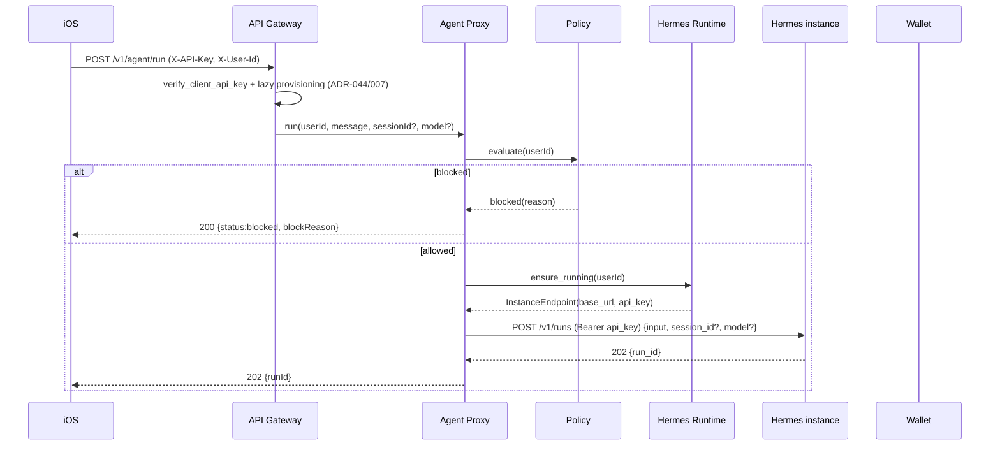

# Agent Proxy — Architecture

## Состав
- `src/app/api_gateway/routers/agent.py` — роутер `/v1/agent/*`, регистрируется в `main.py`.
- `src/app/schemas/agent.py` — Pydantic request/response.
- Потребляет: `HermesInstanceManager` ([Hermes Runtime](../hermes-runtime/README.md)), `PolicyEngine`, `WalletService`, `AuditService`.
- HTTP — `httpx.AsyncClient` (+ `.stream` для SSE), уже в стеке ([02-tech-stack.md](../../02-tech-stack.md)).

## Поток run


## SSE-ретрансляция + биллинг
```mermaid
sequenceDiagram
    participant C as iOS
    participant AP as Agent Proxy
    participant I as Hermes instance
    participant W as Wallet

    C->>AP: GET /v1/agent/runs/{runId}/events
    AP->>I: GET /v1/runs/{runId}/events (SSE, Bearer)
    loop события
        I-->>AP: run.running|message.delta|tool.*|approval.request
        AP-->>C: ретрансляция
    end
    I-->>AP: run.completed {usage}
    AP->>W: consume(userId, amount(usage), idempotency_key=runId)
    AP-->>C: run.completed
    Note over AP,W: run.failed → проброс, без debit
    Note over AP,W: InsufficientCredits → consume откатывает savepoint (нет orphan-строки);<br/>AP пишет audit billing_debit_insufficient; стрим НЕ рвётся (ADR-047 §6)
```

## Обработка ошибок ([ADR-045 §6](../../adr/ADR-045-hermes-as-agent-proxy.md))
- Инстанс недоступен / `ensure_running` не поднял / health fail → `502`.
- Hermes 4xx/5xx → проксируется как соответствующий технический код (не `200 blocked`).
- Бизнес-blocked (policy) → только до прогона, `200 {status:blocked}`.
- Разрыв SSL до `run.completed` → debit на этом соединении не выполнен; повторная подписка довыполнит (idempotency по `runId`); реконсиляция — [Q-047-2](../../99-open-questions.md).

## Биллинг на `run.completed` — недостаток баланса ([ADR-047 §6](../../adr/ADR-047-usage-based-billing-for-agent.md))
- SSE-ретранслятор НЕ рвёт стрим на ошибке биллинга (run уже завершён upstream). При `InsufficientCreditsError` от `consume`:
  - `consume` **сам** откатывает свой savepoint (INSERT debit + неуспешный UPDATE отменены) — **orphan debit-строки не возникает**, баланс не тронут, инвариант `balance == Σ(credit) − Σ(debit)` сохраняется (правка дефекта: ранее проглоченное исключение → commit `session_scope` → фантомная debit-строка в `GET /v1/wallet`).
  - Ретранслятор фиксирует **audit-событие** `billing_debit_insufficient` (`runId`/`usage`/`model`/требуемый `amount`/текущий баланс) — несписанная дельта не теряется молча; это **аудит-запись**, не ledger-строка (финансовый ledger остаётся чистым).
- Реконсиляция несписанной дельты (clawback/hold/блок следующего прогона) — отложена ([Q-047-2](../../99-open-questions.md), [TD-029](../../100-known-tech-debt.md)).

## Инварианты
- Биллинг строго на `run.completed.usage`; `run.failed` не тарифицируется.
- `consume` самодостаточно-атомарен (savepoint, [ADR-047 §6](../../adr/ADR-047-usage-based-billing-for-agent.md)): корректность ledger не зависит от внешнего ROLLBACK; проглатывание `InsufficientCreditsError` на SSE-пути не создаёт orphan-строк.
- Idempotency по `runId` (отдельное пространство ключей, не пересекается с `messageStepId` chat-пути, [03-data-model.md §Источники credit-tx](../../03-data-model.md)).
- `/v1/chat/*` не затрагивается; Hermes не заводится в `LLMClient`.
- Все вызовы инстанса несут `Authorization: Bearer <API_SERVER_KEY>` (расшифрован [Hermes Runtime](../hermes-runtime/README.md), in-memory).
