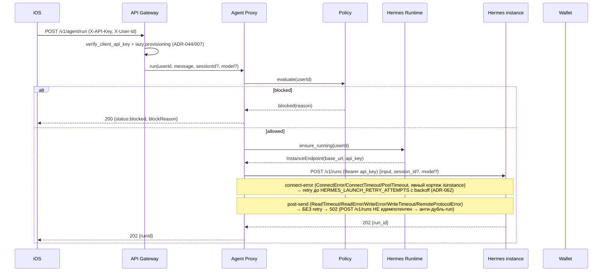

# Agent Proxy — Architecture

## Состав
- `src/app/api_gateway/routers/agent.py` — роутер `/v1/agent/*`, регистрируется в `main.py`.
- `src/app/schemas/agent.py` — Pydantic request/response.
- `src/app/agent_proxy/service.py` — `AgentProxyService`: `run`/`stream_events`/`approval`/`stop`/`resume`/`get_state` **и `process_event` — единственный владелец доменной обработки событий** (+ `_RunProcessing` для трёх межсобытийных переменных).

  ⚠️ **`process_event` ИЗВЛЕЧЕНА, а не скопирована, и вызывается ОБОИМИ контурами** — легаси-relay `stream_events` и новым `consumer.py`. У них **одна** реализация: терминальный статус **до** биллинга, условность переходов (`WHERE status IN ('running','resumed')`), per-column replay-guard снапшота, троттлинг флашей, латчи `divergent`/`non_monotonic` ([ADR-065](../../adr/ADR-065-patched-hermes-image-ghcr.md)) и телескопическая сумма ([ADR-064](../../adr/ADR-064-incremental-agent-run-billing-and-pause-resume.md)). ⛔ **На этапе 4 её НЕ «переносить окончательно»** — переносить нечего, дублирование правил и есть тот дефект, которого извлечение избегает.

  **Доказательство дословности переноса и одновременно регресс на будущее:** наборы тестов [ADR-064](../../adr/ADR-064-incremental-agent-run-billing-and-pause-resume.md)/[ADR-065](../../adr/ADR-065-patched-hermes-image-ghcr.md)/[ADR-066](../../adr/ADR-066-agent-run-state-snapshot.md) прошли **без единой правки**. Любое расхождение правил между контурами их ломает — специального теста «правила совпадают» заводить не нужно.

  **`process_event` ВОЗВРАЩАЕТ синтетический `run.paused`, а не отдаёт его сама.** У relay он уходит клиенту через `yield`, у consumer'а — публикуется в ring. Тот же объект служит **сигналом остановки**, поэтому ни один контур не может «забыть», что прогон здесь закончился: пропустить обработку возвращённого значения нельзя, а пропустить побочный эффект — можно. Терминальный статус пишет **сервисная** обёртка `_mark_terminal(run_id, status)` (вызывает репозиторный `mark_status`, делает `commit` и **проглатывает `SQLAlchemyError`** — сбой записи статуса не рвёт SSE-стрим); порядок обязателен: `_mark_terminal` **до** биллинга и независимо от его исхода ([ADR-066 §3](../../adr/ADR-066-agent-run-state-snapshot.md)).
- `src/app/agent_proxy/runs_repo.py` — репозиторий lifecycle-строки `agent_runs` ([ADR-064](../../adr/ADR-064-incremental-agent-run-billing-and-pause-resume.md)): `create_running`, `record_step`, `mark_paused`, `active_child`, **`mark_status(run_id, status)`** (условный переход `WHERE status IN ('running','resumed')` — источник защиты терминальных статусов от затирания) и **owner-scoped `mark_stopped(run_id, user_id)`** (`AND user_id=:uid`) — [ADR-066 §3](../../adr/ADR-066-agent-run-state-snapshot.md).
- `src/app/agent_proxy/snapshots_repo.py` — репозиторий снапшота `agent_run_snapshots` ([ADR-066](../../adr/ADR-066-agent-run-state-snapshot.md)): upsert с per-column replay-guard, **`clear_pending_approval(run_id, user_id)`** (owner-scoped снятие approval после 2xx `POST …/approval` — **единственный owner-scoped writer** снапшота и третья точка снятия `pending_approval`; без `INSERT`, коммит — teardown request-сессии), чтение для `/state`, retention-sweep. Пишется **только** из relay-пути и этого клиентского вызова; `/state` — чистое чтение.
- `ConsumerRegistry` (**в `lifespan` приложения, [ADR-067 §6.1.1](../../adr/ADR-067-agent-run-background-consumer.md)**) — владелец фоновых consumer-задач. ⚠️ **Живёт на уровне приложения, а не в request-scoped сервисе:** обработчик `POST /v1/agent/run`/`/resume` **просит** запустить consumer'а через `ConsumerLauncher`, но **не владеет** задачей, которая его переживает. Fire-and-forget запрещён — задача без ссылки может быть собрана GC, а §6.4 при остановке воркера некому запустить.
- `ConsumerLauncher` — тонкий фасад, через который сервис обращается к реестру. ⚠️ **`consumers=None` означает «контур выключен»** — это и kill-switch `AGENT_RUN_CONSUMER_ENABLED=false`, и приложение **без `lifespan`** (тестовый клиент); путь запуска в этом случае ведёт себя **ровно как до [ADR-067](../../adr/ADR-067-agent-run-background-consumer.md)**, без ветвлений в бизнес-логике.
- `src/app/agent_proxy/consumer.py` (**новый, [ADR-067](../../adr/ADR-067-agent-run-background-consumer.md)**) — фоновый consumer прогона, **две задачи** ([ADR-067 §6.1](../../adr/ADR-067-agent-run-background-consumer.md)): **рабочая** (единственная upstream-подписка на `GET {base}/v1/runs/{runId}/events`, публикация в ring+канал одним пайплайном с `epoch`, доменная обработка — снапшот-writer + `_mark_terminal` + биллинг, перенос из `stream_events` **без изменения правил**, обновление in-memory beacon прогресса) и **супервизор** (продление lease, heartbeat, `MAX_DURATION` через отмену рабочей задачи, детект зависания обработки). Разделение обязательно: иначе живость становится самозаявлением — независимые петли отмечались бы при зависшей обработке. **Обе задачи — в одной `TaskGroup`-обвязке: гибель или отмена любой отменяет вторую** (иначе переживший супервизора consumer работал бы под ложным `failed` от reaper'а, а его штатная финализация была бы отброшена как дубль по тому же `idempotency_key=runId`). Beacon выставляется **на переходах** (`processing` — **до** входа в обработку) и дополняется монотонными счётчиками прогресса (`bytes_read`, `last_published_seq`): состояние «после итерации» не отличило бы зависший обработчик от штатного ожидания.
- `src/app/agent_proxy/transport.py` (**новый, [ADR-067 §3.1](../../adr/ADR-067-agent-run-background-consumer.md)**) — общий Redis-слой контура: ключи прогона (`:events`, `:pub`, `:lease`, `:seq`, `:epoch`, `:bytes`), атомарная запись события **Lua-скриптом** (нужна атомарность относительно перехвата lease — иначе порядок элементов ring'а разойдётся с порядком `seq` и сломает дедуп broker'а), обрезка головы **циклом `LPOP`** с поддержкой байтового счётчика, продление TTL. **Потребители — все трое:** `consumer.py` (запись), `broker.py` (чтение), orphan-свип в `lifespan` (проверка `uptime` через `INFO server` и наличия lease).
- `src/app/agent_proxy/broker.py` (**новый, [ADR-067 §3.2](../../adr/ADR-067-agent-run-background-consumer.md)**) — downstream для клиентского `/events`. **Порядок обязателен: `SUBSCRIBE` канала → разбор курсора → `LRANGE` ring → live** с дедупом по внутреннему `seq` в пределах поколения. ⚠️ **Подписка идёт ДО чтения ring'а, и это не стилистика:** события, пришедшие в окне между чтением и подпиской, были бы потеряны **безвозвратно** — в ring они уже есть, но клиенту не уйдут, а дедуп по `seq` отбросит их как «старые». Обратный порядок даёт невосполнимую дырку в потоке. Далее: сверка `epoch` в трёх точках ([ADR-067 §3.3.1](../../adr/ADR-067-agent-run-background-consumer.md)), backpressure (переполнение очереди отключает подписчика, не consumer'а), правила закрытия §3.3.
- ⚠️ **Audit из consumer'а — через `ServiceFactory` (`service.record_consumer_event`), НЕ через долгоживущий `AuditService`.** Сервис, связанный с сессией, пережил бы весь прогон и нарушил бы правило «сессия по операции» ([ADR-067 §6.1.1](../../adr/ADR-067-agent-run-background-consumer.md)) — audit подчиняется ему наравне с флашем снапшота и биллингом.
- Потребляет: `HermesInstanceManager` ([Hermes Runtime](../hermes-runtime/README.md)), `PolicyEngine`, `WalletService`, `AuditService` (**на request-путях**; consumer — через `ServiceFactory`, см. выше), **Redis** (ring + pub/sub + lease, [ADR-067](../../adr/ADR-067-agent-run-background-consumer.md); клиент уже в стеке — `redis.asyncio`, [02-tech-stack.md](../../02-tech-stack.md)).
- HTTP — `httpx.AsyncClient` (+ `.stream` для SSE), уже в стеке ([02-tech-stack.md](../../02-tech-stack.md)).

## Поток run

```mermaid
sequenceDiagram
    participant C as iOS
    participant GW as API Gateway
    participant AP as Agent Proxy
    participant P as Policy
    participant HM as Hermes Runtime
    participant I as Hermes instance
    participant W as Wallet

    C->>GW: POST /v1/agent/run (X-API-Key, X-User-Id)
    GW->>GW: verify_client_api_key + lazy provisioning (ADR-044/007)
    GW->>AP: run(userId, message, sessionId?, model?)
    AP->>P: evaluate(userId)
    alt blocked
        P-->>AP: blocked(reason)
        AP-->>C: 200 {status:blocked, blockReason}
    else allowed
        AP->>HM: ensure_running(userId)
        HM-->>AP: InstanceEndpoint(base_url, api_key)
        AP->>I: POST /v1/runs (Bearer api_key) {input, session_id?, model?}
        Note over AP,I: connect-error (ConnectError/ConnectTimeout/PoolTimeout, явный кортеж isinstance)<br/>→ retry до HERMES_LAUNCH_RETRY_ATTEMPTS с backoff (ADR-062)
        Note over AP,I: post-send (ReadTimeout/ReadError/WriteError/WriteTimeout/RemoteProtocolError)<br/>→ БЕЗ retry → 502 (POST /v1/runs НЕ идемпотентен → анти-дубль-run)
        I-->>AP: 202 {run_id}
        AP-->>C: 202 {runId}
    end
```

- **Connect-only retry `_launch_run` ([ADR-062](../../adr/ADR-062-wake-readiness-gate-and-connect-only-launch-retry.md)):** `POST /v1/runs` не идемпотентен (образ Hermes создаёт run на каждый вызов, без ключа) → retry допустим ТОЛЬКО на фазе установки соединения, где тело гарантированно не отправлено. **Retry (safe):** `isinstance(exc, (httpx.ConnectError, httpx.ConnectTimeout, httpx.PoolTimeout))` — **явный кортеж, НЕ по базовому классу** (в httpx `ConnectTimeout` НЕ подкласс `ConnectError`; базы `TimeoutException`/`NetworkError`/`TransportError` захватили бы post-send `ReadTimeout`/`WriteError` → риск дубль-run). До `HERMES_LAUNCH_RETRY_ATTEMPTS` (дефолт `3`) попыток, backoff `HERMES_LAUNCH_RETRY_BACKOFF_SECONDS` (дефолт `2.0`с). **НЕ retry (post-send, риск дубль-run):** `httpx.WriteError`/`WriteTimeout`, `httpx.ReadError`/`ReadTimeout`, `httpx.RemoteProtocolError`, прочие `httpx.HTTPError`, а также non-2xx ответ → сразу `UpstreamError`/`502`. Это страховка поверх wake-readiness-gate ([ADR-062](../../adr/ADR-062-wake-readiness-gate-and-connect-only-launch-retry.md) §1): покрывает остаточную connect-гонку без дублей.

## SSE: broker-модель ([ADR-067](../../adr/ADR-067-agent-run-background-consumer.md), с 2026-07-29)

**Инвариант:** к `/v1/runs/{runId}/events` инстанса Hermes подключается **ровно один потребитель — наш consumer**; клиентский `GET /v1/agent/runs/{runId}/events` к Hermes **не ходит**. **Обоснование не зависит от поведения образа** ([ADR-067 §0](../../adr/ADR-067-agent-run-background-consumer.md)): (1) биллинг не может зависеть от присутствия клиента — измерено 3 прогона → 0 списаний; (2) нужен ровно один владелец биллинга и состояния на прогон; (3) межпроцессный фан-аут при 4 воркерах gunicorn обязателен при любом server-side решении. ✅ **Подтверждено перемером 2026-07-30** ([Q-066-1](../../99-open-questions.md)): поток событий прогона **одноразовый** — историю получает первый подписчик, повторная подписка не получает ни реплея, ни новых событий даже на живом прогоне. Поэтому порядок «consumer подписывается раньше клиента» — **требование корректности**, а не предосторожность, а adoption и ретрай подписки **невозможны** ([Q-067-1](../../99-open-questions.md) Closed отрицательно).

```mermaid
sequenceDiagram
    participant C as iOS
    participant Wx as api worker X
    participant Wy as api worker Y
    participant R as Redis
    participant I as Hermes instance
    participant W as Wallet

    Wx->>I: POST /v1/runs → 202 {run_id}
    Wx->>R: SET lease{runId} NX PX
    Wx->>I: GET /v1/runs/{runId}/events (единственный подписчик)
    Wx-->>C: 202 {runId}
    loop событие
        I-->>Wx: событие
        Wx->>R: RPUSH ring + PUBLISH chan
        Wx->>W: биллинг + снапшот (правила ADR-064/066 без изменений)
    end
    C->>Wy: GET /v1/agent/runs/{runId}/events
    Wy->>R: SUBSCRIBE chan, затем LRANGE ring
    Wy-->>C: реплей + live (с id:<seq>; реконнект по Last-Event-ID — инкрементальный)
    I-->>Wx: run.completed {usage}
    Wx->>W: _mark_terminal ДО биллинга, затем финализация (idempotency runId)
```

- **Consumer стартует** в процессе, обработавшем `POST /v1/agent/run` / `POST …/resume`, сразу после `_launch_run` и **до** отдачи `202` (иначе клиент подпишется первым и выпьет буфер). Отказ установки upstream-подписки **не отменяет прогон** (`POST /v1/runs` неидемпотентен): `202` отдаётся, факт — в audit, добивает orphan-reaper.
- **Правила закрытия downstream ([ADR-067 §3.3](../../adr/ADR-067-agent-run-background-consumer.md)) — обязательны:** терминальное событие может не появиться в Redis никогда; раньше стрим закрывал сам Hermes, теперь закрываем мы (терминальное событие / терминальный `agent_runs.status` / нет lease + пустой ring / периодическая сверка статуса / idle-timeout).
- **Реконнект — по самоидентифицирующему курсору `<epoch>-<seq>`** ([ADR-067 §3.2/§3.4](../../adr/ADR-067-agent-run-background-consumer.md)): каждое событие несёт SSE-поле `id:`, переподключение с `Last-Event-ID`/`?afterSeq=` отдаёт только новые события (дублей нет). `epoch` обязателен: при перезапуске Redis / `FLUSHDB` / истечении TTL счётчик начинается заново, и голый `seq` дал бы навсегда открытый **молчащий** стрим.
- ⚠️ **`epoch` — свойство читающей СЕССИИ, а не только её начала** ([ADR-067 §3.3.1](../../adr/ADR-067-agent-run-background-consumer.md)): он кладётся в каждый элемент ring'а и каждое сообщение канала и сверяется **на событии** и **в периодической сверке**. ⚠️ Третья точка («при восстановлении pub/sub») **сегодня не выполняется** — она не нужна лишь потому, что redis-клиент создан **без retry-конфигурации**, и `PubSub` не переподписывается прозрачно, а роняет стрим ([ADR-067 §3.3.1](../../adr/ADR-067-agent-run-background-consumer.md) п. 2); появится реконнект **или** ретраи в конфиге клиента — сверка обязана прийти тем же изменением. Проверка только при открытии оставила бы дефект у **уже подключённого** клиента: consumer жив (lease не истекает, правила закрытия не срабатывают), новые события идут с `seq` 1,2,3… и отбрасывались бы как «уже отданные». При несовпадении — сброс курсора в `0` + `run.truncated`. ⚠️ **Сессия, открывшаяся БЕЗ поколения** (ключа нет либо Redis не ответил — различать не требуется), обязана его **взвести**: fallback на `epoch` последнего отданного элемента ring'а, а при пустом ring'е — **усыновление первого увиденного** поколения (из события **и** из периодической сверки), **без** `run.truncated` ([ADR-067 §3.3.1a](../../adr/ADR-067-agent-run-background-consumer.md), [TD-044](../../100-known-tech-debt.md)). `run.truncated` при усыновлении — **только** если клиент пришёл с непустым курсором. ⚠️ **Инвариант «событие не отдаётся при невзведённой сверке» необходим, но НЕ достаточен:** сброс `seq` **без** смены `epoch` (истёк TTL ring'а при живом lease) даёт тот же молчащий стрим — против него `ensure_epoch` на **каждом** тике продления lease + детект регресса `last_arrived_seq` в broker'е ([ADR-067 §3.3.1b](../../adr/ADR-067-agent-run-background-consumer.md), [TD-045](../../100-known-tech-debt.md)). Сильный инвариант: **ни одно live-событие не отбрасывается молча**.
- ⛔ **Контракт курсора и дедупа — [ADR-067 §3.2.1](../../adr/ADR-067-agent-run-background-consumer.md), читать вместе с правилом дедупа, а не после него.** У baseline дедупа **три** источника, и только два доказывают отдачу (хвост реплея, отданное live-событие); **клиентский курсор не доказывает ничего и не имеет права быть baseline'ом** — он только **фильтр реплея**, ограниченный сверху фактическим счётчиком (`current_seq`). ⚠️ **Самый достижимый из четырёх известных входов в молчащий стрим** — именно этот: `?afterSeq=` выше максимума на **исправном** прогоне, одним запросом, без отказа инфраструктуры (воспроизведено qa; [TD-046](../../100-known-tech-debt.md)). `?afterSeq=` не несёт `epoch`, поэтому по поколению **неверифицируем в принципе** и принимается только вместе с `run.truncated`. ⛔ **Критерий корректности — `A ∧ B ∧ C`:** A — провенанс baseline, B — сопоставимость нумерации, **C — оповещение** (всякое нарушение A/B и всякий сброс baseline объявлены `run.truncated`). **Два из четырёх известных входов были именно C, при корректном сравнении:** маркер реплея умирал вместе с пустым набором, а периодическая ветка сбрасывала baseline молча. Отсюда: маркер рождается в `stream()`; отдаётся и из периодической ветки; несёт `seq = 0` и не двигает baseline; `?afterSeq=0` — исключение без маркера. Baseline — **верхняя метка**, поэтому сессия помнит `replay_min_seq` и считает `event.seq < replay_min_seq` разрывом, а не дублем ([TD-046](../../100-known-tech-debt.md), [TD-047](../../100-known-tech-debt.md)). ⚠️ **Состав C выведен из потока оповещения (шесть членов), а не собран по находкам:** разрыв назад (C1), **разрыв вперёд** (C2 — новая мера: `event.seq > delivered + 1` при `delivered > 0`; единственное клиентское оповещение для нераспарсенного или потерянного сообщения канала — лог им не является), **первый отданный `seq` > фильтр + 1 независимо от фазы** (C3 — снимает молчащий пропуск **начала** прогона при усыновлении с непрочитанным ring'ом), объявленный сброс знания (C4), неподтверждённое притязание клиента (C5), достижимость и достоверность самого маркера (C6). **Два уровня разведены:** `run.truncated` — клиентское оповещение, `warning`/`debug` — операторская наблюдаемость, и второе первое **не заменяет**. ⚠️ **C1 разделён на C1a/C1b** — эффект на baseline **противоположный** (перезапуск нумерации обнуляет метку, дырка при той же нумерации её сохраняет), **порядок разрешения `C4 > C1a > C1b > C2`**, максимум **один** маркер на сообщение.
- ⛔ **Backpressure измеряет не то, что декларирует** ([ADR-067 §3.2.2](../../adr/ADR-067-agent-run-background-consumer.md), [TD-048](../../100-known-tech-debt.md)): счётчик сообщений **между двумя простоями канала** — это размер всплеска, скорость клиента в нём не участвует ⇒ **быстрый здоровый** клиент отключается на непрерывной выдаче, **медленный** не отключается никогда. Решение: задача-читатель + явная `asyncio.Queue(maxsize=AGENT_RUN_SUBSCRIBER_QUEUE_MAX)`, `QueueFull` ⇒ осознанное отключение (клиентский маркер не нужен и невозможен: префикс цел, недоставленное остаётся в ring'е, при обрезке разрыв объявит C3 — обязателен лишь операторский `warning`).
- ⛔ **Ось D — живучесть конвейера доставки** ([ADR-067 §3.2.1](../../adr/ADR-067-agent-run-background-consumer.md), **правило закрытия 6** в §3.3): `A ∧ B ∧ C` говорят о событии, которое **дошло**; отказ звена доставки (смерть задачи-читателя) не доводит **ничего**, и его не видит ни один член — правила 4/5 требуют терминального статуса и мёртвого lease, которых нет. **Два режима отказа звена, требования разные:** **D1 «умерло»** — сильная ссылка, отмена в `finally` **завершающаяся за ограниченное время** (⛔ инвариант: в горячем пути нет `shield`, `except CancelledError` без `raise`, `except BaseException`, bare `except:` — иначе `TaskGroup.__aexit__` при отключении клиента ждёт детей неограниченно, вешает `aclose()` и утекает задачей обработчика; вред здесь **наш**, а не клиентский), завершение по любой причине **закрывает** стрим; **D2 «зависло»** — предельный срок у каждого `await` в цикле доставки **либо** вынос периодических проверок (`_is_terminal`, `lease_alive`) с пути доставки. ⚠️ **D2 нельзя закрыть признаком:** признак правила 6 снимается **в цикле отдачи**, а он и заблокирован. Сегодня предела нет — `DB_POOL_TIMEOUT` ограничивает только ожидание из пула, `statement_timeout`/`lock_timeout` не заданы ([Q-067-20](../../99-open-questions.md)); это тот же класс, что [TD-040](../../100-known-tech-debt.md). Критерий — **`A ∧ B ∧ C ∧ D`**. ⛔ **Путь завершения не проходит через полную очередь** — иначе сигнал недоступен ровно в том отказе, для которого введён.
- ⛔ **Клиентская сессия = ТРИ задачи** (симметрично §6.1, [ADR-067 §3.2.2](../../adr/ADR-067-agent-run-background-consumer.md)); ⚠️ **конструкция группировки не зафиксирована как `TaskGroup`** — teardown обязан **возвращаться, а не бросать** (`GeneratorExit` есть `BaseException`, и `TaskGroup.__aexit__` перебрасывает его завёрнутым в `BaseExceptionGroup`, то есть `aclose()` бросает), поэтому заменяющая конструкция обязана явно предъявить четыре свойства строки «Разрыв конвейера»: **возврат вместо броска**, **отменяемость за ограниченное время**, **исключение звена отменяет остальные**, **нормальное завершение звена НЕ отменяет остальные** (последние два приходили с группой «бесплатно»): **читатель** (`SUBSCRIBE` → `LRANGE` → классификация §3.2.1 → очередь причитающегося), **писатель** (`get` → запись клиенту), **супервизор** (периодические проверки правил закрытия 4/5 и idle). Реплей — **в читателе**: иначе baseline готов позже первых канальных сообщений, и клиент получает всё перекрытие **вторым экземпляром**. Периодические проверки в читателе **запрещены** — блокировка остановила бы и чтение, и запись. Мера «подтверждение подписки» **снята** как ненужная после переноса реплея. **Завершение разведено:** штатное — **флаг «штатный конец» перед sentinel'ом** (писатель решает по флагу: `peek` в `asyncio.Queue` нет, поэтому «увидеть sentinel за элементами» неисполнимо) + осушение очереди в пределах `AGENT_RUN_SUBSCRIBER_DRAIN_SECONDS`, клиент получает `run.completed`; аварийное — `Event`/отмена вне очереди, очередь бросается. **Переход в live — по гистерезису** (`qsize()` ≤ половины порога): на границе фаз очередь полна по построению, и переключение guard'а там отключало бы клиента, успешно получившего реплей. **Бюджет — два независимых срока от одного значения**, причём срок ограничивает **одно ожидание** (отсчёт от последнего успешного прогресса), а «`2 ×`» — граница названного худшего случая, **не** универсальный потолок (доминирует `AGENT_RUN_MAX_DURATION_SECONDS`). ⛔ **Флага штатного конца НЕДОСТАТОЧНО:** правило 4 истинно с первой секунды у прогона, терминального на открытии, поэтому нужен ещё **отступ супервизора, пока идёт причитающаяся выдача** — предикат из **двух** конъюнктов: **(а) `not queue.empty()`** и **(б)** последняя отданная порция свежее `AGENT_RUN_SUBSCRIBER_DRAIN_SECONDS` (односторонее состояние **писатель** → супервизор, перепроверка **после** probe, отступ — **пропуск тика**, не выход из цикла). ⚠️ **Оба конъюнкта несущие, с измеренными отказами:** без (а) супервизор молчит весь бюджет после завершённой выдачи (правило 5 не срабатывало вовсе — таймаут `15 с` против прежних `~2 с`), без (б) заглушение бессрочно при замолчавшем клиенте. **`settled` снят полностью;** распознавание терминального события осталось за **штатным концом** (флаг + sentinel), не за отступом. ⛔ **Признак — прогресс, а не «читатель знает исход»:** бессрочный отступ выключал бы правила 4/5 **навсегда** (а вместе с правилом 4 — наблюдаемость `AGENT_RUN_MAX_DURATION_SECONDS`), и перечень «что читатель узнал» неполон по построению — терминальность пишет consumer в БД, супервизор видит её раньше канала. Нет прогресса дольше срока ⇒ правила 4/5 **возвращаются**. Оба механизма несущие; отмена супервизора — необязательная оптимизация. ⚠️ Инвариант, от которого зависит C1a после введения очереди: **один читатель, один потребитель, FIFO**. Перед `LRANGE` обязательно **подтверждение подписки**, а не только `create_task` ([TD-048](../../100-known-tech-debt.md) ↔ [TD-047](../../100-known-tech-debt.md)). Без курсора — полный реплей, и такой клиент обязан сбрасывать накопленный текст. При обрезанном ring'е поток предваряется обязательным `run.truncated` — иначе сброс текста молча заменил бы полный текст на неполный.
- **Клиентский путь — чисто читающий:** ни `consume`, ни апсерта снапшота, ни `mark_status`. Побочный эффект: возражение «как не задвоить debit при живом клиентском relay» ([ADR-066 §Alternatives 1](../../adr/ADR-066-agent-run-state-snapshot.md)) **растворяется** — задваивать нечего; остаточная защита — ledger-идемпотентность `runId:step`/`runId`.
- **Порядок запуска ([ADR-067 §6.1.2](../../adr/ADR-067-agent-run-background-consumer.md)):** `_launch_run` → `create_running` + audit → **коммит** → ожидание handshake (≤ `AGENT_RUN_HANDSHAKE_TIMEOUT_SECONDS`, 15 с) → `202`. ⛔ Ждать handshake **до** `create_running` запрещено: с момента ответа инстанса прогон существует и тратит токены, а reaper достаёт кандидатов **только из `agent_runs`** — прогон без строки не добьёт никто. Ожидание — средство **наблюдаемости**, не гейт корректности (клиент к Hermes не ходит, за поток не конкурирует); истечение не фатально.
- **Жизнеобеспечение фоновой задачи ([ADR-067 §6.1.1](../../adr/ADR-067-agent-run-background-consumer.md)):** сессия БД — **по операции** (одна долгоживущая на прогон запрещена: пул нормирован формулой `(DB_POOL_SIZE + DB_MAX_OVERFLOW) × workers × replicas`, а число одновременных прогонов не ограничено — [Q-067-2](../../99-open-questions.md)); ⚠️ **сессия не удерживается через `await` на upstream** — прямой урок [TD-040](../../100-known-tech-debt.md). Задача цепляется к **реестру в `lifespan`**; fire-and-forget запрещён (задача без ссылки может быть собрана GC, а §6.4 при остановке воркера некому запустить). Остановка: отмена consumer'ов → §6.4 в бюджете `AGENT_RUN_SHUTDOWN_DRAIN_SECONDS` → **только потом** закрытие пула БД и Redis.
- ⛔ **Порядок остановки — требование, а не рекомендация:** дренаж consumer'ов выполняется **до** закрытия пула БД и Redis. При обратном порядке §6.4 не сможет ни доflushить снапшот, ни снять lease — **штатная остановка выродится в аварийную** (прогон будет ждать `LEASE_TTL + ORPHAN_TIMEOUT` вместо немедленной передачи reaper'у). Проверяется **по фактическим позициям вызовов в `lifespan`**, а не по намерению.
- **Владение при 4 воркерах gunicorn** (`Dockerfile: -w 4`) — Redis-lease `agent:run:{runId}:lease` (`SET NX PX` 30 с, продление 10 с) **плюс heartbeat в отдельной колонке `agent_run_snapshots.consumer_heartbeat_at`** (миграция `0020`, запись — **отдельным `UPDATE` одной колонки**, апсерт снапшота для этого запрещён: он двигает `updated_at` безусловно) раз в `AGENT_RUN_CONSUMER_HEARTBEAT_SECONDS` и **пока выполняется правило живости** ([ADR-067 §6.1](../../adr/ADR-067-agent-run-background-consumer.md)) — ⚠️ НЕ «только при росте счётчиков». Heartbeat живёт **вне Redis** — единственный признак живости, переживающий его перезапуск. ⚠️ **Ни `agent_runs.updated_at`, ни `agent_run_snapshots.updated_at` не годятся:** первое отдаётся клиенту как `/state.updatedAt`, когда строки снапшота нет ([ADR-066 §5](../../adr/ADR-066-agent-run-state-snapshot.md)) — heartbeat утёк бы в детектор устаревания — и разогревает «денежную» строку, обнуляя обоснование разделения таблиц ([ADR-066 §2](../../adr/ADR-066-agent-run-state-snapshot.md)); второе и есть сам детектор устаревания. Lease — оптимизация: корректность биллинга держится на идемпотентности ключей.
- ⚠️ **Lease — трёхзначный в обеих операциях, и «Redis не ответил» НЕ означает «уходим» ([ADR-067 §4.1](../../adr/ADR-067-agent-run-background-consumer.md)).** `acquire_lease` → `ACQUIRED` / `HELD_ELSEWHERE` / `UNKNOWN`, `renew_lease` → `RENEWED` / `REACQUIRED` / `LOST` / `UNKNOWN`. Самоустранение остаётся **только** при **чужом** владельце ключа; при `RedisError` consumer **ведёт прогон без lease** — биллинг, снапшот и терминальный статус живут в Postgres, теряется лишь живой фан-аут. Причина: единственность upstream-подписчика обеспечена **архитектурно** (клиентский `/events` к Hermes не ходит; consumer стартует ровно из `run()`/`resume()` на свежем `run_id`; `ConsumerRegistry` идемпотентен по `run_id`), а adoption закрыт навсегда — то есть при мёртвом Redis взаимное исключение теряет **участника, которого не существует**, тогда как уход стоит прогону всей выручки и всего ответа (одноразовый поток не прочитает больше никто). Работа без lease уже предусмотрена свипом: его условие 2 — heartbeat в Postgres — введено именно для «consumer жив, lease нет». Guard инертной подписки при этом **полностью работоспособен**: `bytes_read` — счётчик в памяти воркера (колбэк `on_bytes` на сырых чанках), а не Redis-ключ `…:bytes` (тот считает размер ring'а). ⚠️ **Правка одного `acquire_lease` без `renew_lease` запрещена:** прогон был бы убит на первом тике продления, уже потребив одноразовый поток, — хуже прежнего.
- **Детектор смерти upstream — транспортный, не временной ([ADR-067 §6.2](../../adr/ADR-067-agent-run-background-consumer.md)).** TCP keep-alive на сокете подписки (явные `socket_options`: `SO_KEEPALIVE` + `TCP_KEEPIDLE`/`TCP_KEEPINTVL`/`TCP_KEEPCNT` — у `httpx` прямого knob'а нет, а Linux-дефолт 7200 с сделал бы детектор фиктивным; сквозная работа через `hermes-net` — [Q-067-9](../../99-open-questions.md)) + **отключённый read-timeout**: мёртвый пир даёт ошибку чтения, молчание — нет. ⚠️ **Idle-таймаут по доменным событиям запрещён** (был в первой редакции ADR-067 и отозван): для агента пауза >10 мин на длинном tool-call штатна, а самозавершение по молчанию сняло бы lease и heartbeat у **работающего** прогона — reaper затарифицировал бы его по неполному кумулятиву и пометил `failed`.
- **Потолок длительности прогона** `AGENT_RUN_MAX_DURATION_SECONDS` (2 ч) — **продуктовое ограничение** ([Q-067-8](../../99-open-questions.md)), а не эвристика живости; применяется супервизором **через отмену** рабочей задачи. После отзыва idle-таймаута это единственный временной ограничитель, и вся верхняя граница выводится из него.
- **Зависание нашей обработки** (`AGENT_RUN_PROCESSING_STALL_SECONDS`, 120 с в состоянии `processing` при живом сокете) → супервизор прекращает heartbeat, снимает lease и отменяет рабочую задачу. Ожидание событий (`awaiting_upstream`) живостью не нарушает и может длиться часами.
- **Самозавершение (§6.4)** при потолке длительности / обрыве установленной подписки / исчерпании connect-ретраев / остановке воркера: флаш снапшота → **снятие lease и heartbeat** → audit; терминальный статус consumer **не выставляет** и биллинг не финализирует (исхода он не знает) — это делает reaper.
- ⚠️ **Ретрай подписки — два разных случая ([ADR-067 §6.4.1](../../adr/ADR-067-agent-run-background-consumer.md)):** обрыв **уже установленной** подписки → ретрай **запрещён навсегда** (поток одноразовый: переподключение ничего не даст, но удержит lease/heartbeat и заблокирует reaper); отказ на **connect**-фазе — **тоже запрещён**: замер 2026-07-30 ([Q-067-13](../../99-open-questions.md)) показал, что подписка, оборванная **до получения заголовков**, всё равно забирает поток (свежая подписка получила 0 событий за 35 с), то есть безопасного окна для повторной попытки не существует. Механизм connect-retry **удалён из дизайна**, а не оставлен под флагом.
- **Guard на инертную подписку ([ADR-067 §6.4.2](../../adr/ADR-067-agent-run-background-consumer.md)):** пока `bytes_read == 0`, beacon держится в `connecting` и подчинён `AGENT_RUN_FIRST_BYTE_STALL_SECONDS` (**180 с**). После первого байта guard не действует — молчание живого потока не затрагивается. ⚠️ Порог взят с запасом к **неизмеренной** величине: образ не эмитит структурного события при подписке, первым идёт контентное, поэтому измеренные `0.184 с` относятся к быстрым текстовым ответам, а худший случай открыт ([Q-067-14](../../99-open-questions.md)); ложное срабатывание убило бы **работающий** прогон, уже потребивший **одноразовый** поток, — повторить его нечем ([ADR-067 §6.4.1](../../adr/ADR-067-agent-run-background-consumer.md)).
- ⛔ **Расклинивание инстанса ОТМЕНЕНО** ([ADR-067 §5.1](../../adr/ADR-067-agent-run-background-consumer.md)): предпосылка ([TD-039](../../100-known-tech-debt.md)) опровергнута — заклинивался **наш row-lock**, удерживавшийся через сетевой вызов, а не инстанс; фикс [TD-040](../../100-known-tech-debt.md) снял симптом, что подтверждено на проде дважды (`202` за 0.318 с и 0.217 с по прежнему рецепту). Решающий признак: `202` **с `runId`** требует успешного round-trip к инстансу. Вместо механизма — **tripwire** [Q-067-17](../../99-open-questions.md): кластеризация `502 upstream_timeout` по одному пользователю возвращает предпосылку. ⚠️ **Приёмка Phase 9 — по ОДНОМУ критерию (корректность учёта);** второй критерий «по доступности» снят вместе с механизмом ([07-implementation-phases.md](07-implementation-phases.md), [09-testing.md](09-testing.md)) — проверять нечего, пока tripwire не вернёт предпосылку.
- **Страховка — orphan-reaper** в существующем `lifespan`-цикле ([ADR-067 §5](../../adr/ADR-067-agent-run-background-consumer.md)). Кандидат = **нет живого lease** И **протух heartbeat** (`COALESCE(agent_run_snapshots.consumer_heartbeat_at, agent_runs.created_at)` старше `AGENT_RUN_ORPHAN_TIMEOUT_SECONDS` — ⚠️ **`updated_at` в свипе не участвует вовсе**: он двигается записью биллинга и статуса, то есть отражал бы **нашу** активность в БД, а не потребление потока; `COALESCE` же даёт fallback на `created_at`, покрывающий главный целевой случай — consumer не встал вообще и heartbeat'а нет в природе) И **Redis доступен дольше** `AGENT_RUN_ORPHAN_REDIS_GRACE_SECONDS`. Последние два условия — защита от массовой ложной финализации при перезапуске Redis (все lease исчезают разом) и от ложных срабатываний на длинном tool-call/флаге OFF; дополнительный предохранитель — `AGENT_RUN_ORPHAN_MAX_PER_TICK`. Действие: best-effort финализация по последнему наблюдённому кумулятиву **за вычетом `charged_for_run(runId)`** (тот же idempotency `runId`) → `_mark_terminal('failed')` → audit `agent_run_orphan_finalized`. ⚠️ Reaper — страховка статуса; в части выручки его эффективность **условна** и зависит от [Q-067-4](../../99-open-questions.md) (несёт ли hydrate токены).
- ⚠️ **Свип обязан различать «usage не наблюдался вовсе» и «наблюдённый ноль» ([ADR-067 §5.2](../../adr/ADR-067-agent-run-background-consumer.md)).** `COALESCE(s.input_tokens, 0)` склеивает отсутствие строки снапшота (consumer не дошёл даже до её создания — своего первого обращения к БД) с измеренным нулём. Терминальный статус остаётся `failed` и остаётся безусловным (иначе возвращается вечный `running` и отменяется верхняя граница), но **списание нулём перестаёт быть молчаливым**: `billingBasis` ∈ `snapshot` \| `zero_usage` \| `no_snapshot` в audit-payload + счётчик `agent_run_orphan_finalized_total{basis}` (ограниченный enum, без `userId`/`runId`). **`no_snapshot` — инцидент выручки, а не строка статистики:** он означает, что consumer не стартовал вообще, и после [ADR-067 §4.1](../../adr/ADR-067-agent-run-background-consumer.md) его основная причина устранена.
- **Гибернация:** consumer обновляет `hermes_instances.last_active_at` при флаше снапшота — `stop_idle` ([ADR-046](../../adr/ADR-046-per-user-hermes-runtime.md)) не гасит инстанс под работающим прогоном.
- **Kill-switch** `AGENT_RUN_CONSUMER_ENABLED=false` → схема ниже (легаси прямой relay). Двойной путь временный — [TD-038](../../100-known-tech-debt.md).

## SSE-ретрансляция + биллинг (легаси-путь, `AGENT_RUN_CONSUMER_ENABLED=false`)
```mermaid
sequenceDiagram
    participant C as iOS
    participant AP as Agent Proxy
    participant I as Hermes instance
    participant W as Wallet

    C->>AP: GET /v1/agent/runs/{runId}/events
    AP->>I: GET /v1/runs/{runId}/events (SSE, Bearer)
    loop события
        I-->>AP: run.running|message.delta|tool.*|approval.request
        AP-->>C: ретрансляция
    end
    I-->>AP: run.completed {usage}
    AP->>W: consume(userId, amount(usage), idempotency_key=runId)
    AP-->>C: run.completed
    Note over AP,W: run.failed → проброс, без debit
    Note over AP,W: InsufficientCredits → consume откатывает savepoint (нет orphan-строки);<br/>AP пишет audit billing_debit_insufficient; стрим НЕ рвётся (ADR-047 §6)
```

## Обработка ошибок ([ADR-045 §6](../../adr/ADR-045-hermes-as-agent-proxy.md))
- Инстанс недоступен / `ensure_running` не поднял / health fail → `502`. ⚠️ **С 2026-07-30 код различается** ([02-api-contracts.md §Коды 502](02-api-contracts.md), [TD-040](../../100-known-tech-debt.md)): `upstream_timeout` — инстанс **промолчал** (истёк дедлайн фазы HTTP, readiness-gate, сквозного бюджета `HERMES_LAUNCH_BUDGET_SECONDS` или ожидания row-lock); `upstream_error` — инстанс **отказал** (refused/reset/DNS/протокол, Hermes 5xx) либо исход определён. Правило: *промолчал* → timeout, *ответил отказом либо исход известен* → error.
- **Сквозной бюджет launch-пути** `HERMES_LAUNCH_BUDGET_SECONDS` (150 с) + разведённая connect-фаза `HERMES_CONNECT_TIMEOUT_SECONDS` (10 с) — фикс [TD-040](../../100-known-tech-debt.md): раньше connect получал общий 30-секундный proxy-таймаут, и connect-only retry ([ADR-062](../../adr/ADR-062-wake-readiness-gate-and-connect-only-launch-retry.md)) **умножал** его в `3×30+2×2 = 94 с`. ⚠️ Вызовы docker-демона в бюджет **не входят** — [TD-041](../../100-known-tech-debt.md). Транзиентная connect-ошибка `POST /v1/runs` (напр. остаточное окно wake) → connect-only retry перед `502` ([ADR-062](../../adr/ADR-062-wake-readiness-gate-and-connect-only-launch-retry.md), см. выше).
- Hermes 4xx/5xx → проксируется как соответствующий технический код (не `200 blocked`).
- Бизнес-blocked (policy) → только до прогона, `200 {status:blocked}`.
- ~~Разрыв SSL до `run.completed` → debit на этом соединении не выполнен; повторная подписка довыполнит (idempotency по `runId`); реконсиляция — [Q-047-2](../../99-open-questions.md).~~ ⚠️ **Исправлено 2026-07-29:** митигация «повторная подписка довыполнит debit» негодна как гарантия — она требует действия клиента, а измерено, что клиент его не совершает (3 прод-прогона → **0 списаний**, `trialRemaining`=1, прогон висел `running` >15 мин, [TD-037](../../100-known-tech-debt.md)). Idempotency по `runId` защищает от **двойного** списания, но не восстанавливает **несделанное**. ✅ **Перемер 2026-07-30 ([Q-066-1](../../99-open-questions.md) Closed) показал большее:** поток одноразовый — повторная подписка не получает ни реплея, ни новых событий даже на живом прогоне, то есть потерянное списание не восстановимо **в принципе**. Решение — broker-модель выше ([ADR-067](../../adr/ADR-067-agent-run-background-consumer.md)); [Q-047-2](../../99-open-questions.md) закрыт.

## Биллинг на `run.completed` — недостаток баланса ([ADR-047 §6](../../adr/ADR-047-usage-based-billing-for-agent.md))
- SSE-ретранслятор НЕ рвёт стрим на ошибке биллинга (run уже завершён upstream). При `InsufficientCreditsError` от `consume`:
  - `consume` **сам** откатывает свой savepoint (INSERT debit + неуспешный UPDATE отменены) — **orphan debit-строки не возникает**, баланс не тронут, инвариант `balance == Σ(credit) − Σ(debit)` сохраняется (правка дефекта: ранее проглоченное исключение → commit `session_scope` → фантомная debit-строка в `GET /v1/wallet`).
  - Ретранслятор фиксирует **audit-событие** `billing_debit_insufficient` (`runId`/`usage`/`model`/требуемый `amount`/текущий баланс) — несписанная дельта не теряется молча; это **аудит-запись**, не ledger-строка (финансовый ledger остаётся чистым).
- Реконсиляция несписанной дельты (clawback/hold/блок следующего прогона) — отложена ([Q-047-2](../../99-open-questions.md), [TD-029](../../100-known-tech-debt.md)).

## Инварианты
- **Единственный upstream-подписчик Hermes — фоновый consumer** ([ADR-067 §1](../../adr/ADR-067-agent-run-background-consumer.md)). Клиентский `/events` — downstream-читатель, он не тарифицирует, не пишет снапшот и не двигает статус.
- **Никакой сбой downstream не влияет на upstream:** медленный/оборвавшийся клиент отключается, consumer продолжает вести прогон до терминального события.
- **Каждый прогон получает терминальный статус за конечное время** — не дольше `AGENT_RUN_MAX_DURATION_SECONDS + AGENT_RUN_ORPHAN_TIMEOUT_SECONDS +` один тик reaper'а. ⚠️ **Оговорки (три):** инвариант действует, только если `AGENT_RUN_MAX_DURATION_SECONDS` конечен ([Q-067-8](../../99-open-questions.md)) и пока супервизор жив (иначе lease/heartbeat протухают сами — тоже к reaper'у); и **пока Redis доступен**: при его недоступности или `uptime` меньше grace orphan-свип не выполняется (fail-closed, [ADR-067 §5](../../adr/ADR-067-agent-run-background-consumer.md)) и прогоны ждут восстановления. Сознательный размен: ложная финализация работающего прогона (списание + `failed`) дороже задержки доводки.
- **Redis — эфемерный транспорт, не источник истины:** потеря ключей стоит только живого стрима; биллинг, статус и `/state` живут в Postgres.
- Биллинг строго на `run.completed.usage`; `run.failed` не тарифицируется.
- `consume` самодостаточно-атомарен (savepoint, [ADR-047 §6](../../adr/ADR-047-usage-based-billing-for-agent.md)): корректность ledger не зависит от внешнего ROLLBACK; проглатывание `InsufficientCreditsError` на SSE-пути не создаёт orphan-строк.
- Idempotency по `runId` (отдельное пространство ключей, не пересекается с `messageStepId` chat-пути, [03-data-model.md §Источники credit-tx](../../03-data-model.md)).
- `/v1/chat/*` не затрагивается; Hermes не заводится в `LLMClient`.
- Все вызовы инстанса несут `Authorization: Bearer <API_SERVER_KEY>` (расшифрован [Hermes Runtime](../hermes-runtime/README.md), in-memory).
