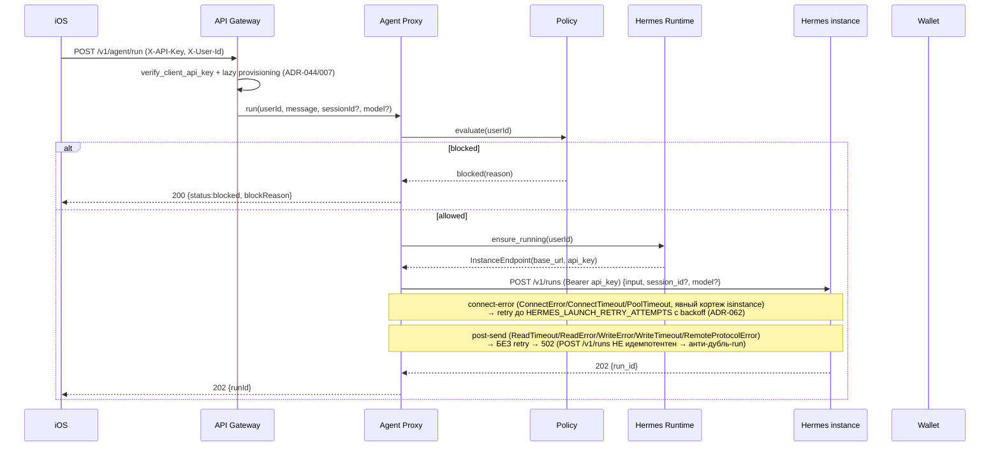

# Agent Proxy — Architecture

## Состав
- `src/app/api_gateway/routers/agent.py` — роутер `/v1/agent/*`, регистрируется в `main.py`.
- `src/app/schemas/agent.py` — Pydantic request/response.
- `src/app/agent_proxy/service.py` — `AgentProxyService`: `run`/`stream_events`/`approval`/`stop`/`resume`/`get_state`. Терминальный статус пишет **сервисная** обёртка `_mark_terminal(run_id, status)` (вызывает репозиторный `mark_status`, делает `commit` и **проглатывает `SQLAlchemyError`** — сбой записи статуса не рвёт SSE-стрим); порядок обязателен: `_mark_terminal` **до** биллинга и независимо от его исхода ([ADR-066 §3](../../adr/ADR-066-agent-run-state-snapshot.md)).
- `src/app/agent_proxy/runs_repo.py` — репозиторий lifecycle-строки `agent_runs` ([ADR-064](../../adr/ADR-064-incremental-agent-run-billing-and-pause-resume.md)): `create_running`, `record_step`, `mark_paused`, `active_child`, **`mark_status(run_id, status)`** (условный переход `WHERE status IN ('running','resumed')` — источник защиты терминальных статусов от затирания) и **owner-scoped `mark_stopped(run_id, user_id)`** (`AND user_id=:uid`) — [ADR-066 §3](../../adr/ADR-066-agent-run-state-snapshot.md).
- `src/app/agent_proxy/snapshots_repo.py` — репозиторий снапшота `agent_run_snapshots` ([ADR-066](../../adr/ADR-066-agent-run-state-snapshot.md)): upsert с per-column replay-guard, **`clear_pending_approval(run_id, user_id)`** (owner-scoped снятие approval после 2xx `POST …/approval` — **единственный owner-scoped writer** снапшота и третья точка снятия `pending_approval`; без `INSERT`, коммит — teardown request-сессии), чтение для `/state`, retention-sweep. Пишется **только** из relay-пути и этого клиентского вызова; `/state` — чистое чтение.
- `src/app/agent_proxy/consumer.py` (**новый, [ADR-067](../../adr/ADR-067-agent-run-background-consumer.md)**) — фоновый consumer прогона, **две задачи** ([ADR-067 §6.1](../../adr/ADR-067-agent-run-background-consumer.md)): **рабочая** (единственная upstream-подписка на `GET {base}/v1/runs/{runId}/events`, публикация в ring+канал одним пайплайном с `epoch`, доменная обработка — снапшот-writer + `_mark_terminal` + биллинг, перенос из `stream_events` **без изменения правил**, обновление in-memory beacon прогресса) и **супервизор** (продление lease, heartbeat, `MAX_DURATION` через отмену рабочей задачи, детект зависания обработки). Разделение обязательно: иначе живость становится самозаявлением — независимые петли отмечались бы при зависшей обработке. **Обе задачи — в одной `TaskGroup`-обвязке: гибель или отмена любой отменяет вторую** (иначе переживший супервизора consumer работал бы под ложным `failed` от reaper'а, а его штатная финализация была бы отброшена как дубль по тому же `idempotency_key=runId`). Beacon выставляется **на переходах** (`processing` — **до** входа в обработку) и дополняется монотонными счётчиками прогресса (`bytes_read`, `last_published_seq`): состояние «после итерации» не отличило бы зависший обработчик от штатного ожидания.
- `src/app/agent_proxy/broker.py` (**новый, [ADR-067 §3](../../adr/ADR-067-agent-run-background-consumer.md)**) — downstream для клиентского `/events`: `SUBSCRIBE` канала → `LRANGE` ring → live с дедупом по внутреннему `seq`; backpressure (переполнение очереди отключает подписчика, не consumer'а).
- Потребляет: `HermesInstanceManager` ([Hermes Runtime](../hermes-runtime/README.md)), `PolicyEngine`, `WalletService`, `AuditService`, **Redis** (ring + pub/sub + lease, [ADR-067](../../adr/ADR-067-agent-run-background-consumer.md); клиент уже в стеке — `redis.asyncio`, [02-tech-stack.md](../../02-tech-stack.md)).
- HTTP — `httpx.AsyncClient` (+ `.stream` для SSE), уже в стеке ([02-tech-stack.md](../../02-tech-stack.md)).

## Поток run

```mermaid
sequenceDiagram
    participant C as iOS
    participant GW as API Gateway
    participant AP as Agent Proxy
    participant P as Policy
    participant HM as Hermes Runtime
    participant I as Hermes instance
    participant W as Wallet

    C->>GW: POST /v1/agent/run (X-API-Key, X-User-Id)
    GW->>GW: verify_client_api_key + lazy provisioning (ADR-044/007)
    GW->>AP: run(userId, message, sessionId?, model?)
    AP->>P: evaluate(userId)
    alt blocked
        P-->>AP: blocked(reason)
        AP-->>C: 200 {status:blocked, blockReason}
    else allowed
        AP->>HM: ensure_running(userId)
        HM-->>AP: InstanceEndpoint(base_url, api_key)
        AP->>I: POST /v1/runs (Bearer api_key) {input, session_id?, model?}
        Note over AP,I: connect-error (ConnectError/ConnectTimeout/PoolTimeout, явный кортеж isinstance)<br/>→ retry до HERMES_LAUNCH_RETRY_ATTEMPTS с backoff (ADR-062)
        Note over AP,I: post-send (ReadTimeout/ReadError/WriteError/WriteTimeout/RemoteProtocolError)<br/>→ БЕЗ retry → 502 (POST /v1/runs НЕ идемпотентен → анти-дубль-run)
        I-->>AP: 202 {run_id}
        AP-->>C: 202 {runId}
    end
```

- **Connect-only retry `_launch_run` ([ADR-062](../../adr/ADR-062-wake-readiness-gate-and-connect-only-launch-retry.md)):** `POST /v1/runs` не идемпотентен (образ Hermes создаёт run на каждый вызов, без ключа) → retry допустим ТОЛЬКО на фазе установки соединения, где тело гарантированно не отправлено. **Retry (safe):** `isinstance(exc, (httpx.ConnectError, httpx.ConnectTimeout, httpx.PoolTimeout))` — **явный кортеж, НЕ по базовому классу** (в httpx `ConnectTimeout` НЕ подкласс `ConnectError`; базы `TimeoutException`/`NetworkError`/`TransportError` захватили бы post-send `ReadTimeout`/`WriteError` → риск дубль-run). До `HERMES_LAUNCH_RETRY_ATTEMPTS` (дефолт `3`) попыток, backoff `HERMES_LAUNCH_RETRY_BACKOFF_SECONDS` (дефолт `2.0`с). **НЕ retry (post-send, риск дубль-run):** `httpx.WriteError`/`WriteTimeout`, `httpx.ReadError`/`ReadTimeout`, `httpx.RemoteProtocolError`, прочие `httpx.HTTPError`, а также non-2xx ответ → сразу `UpstreamError`/`502`. Это страховка поверх wake-readiness-gate ([ADR-062](../../adr/ADR-062-wake-readiness-gate-and-connect-only-launch-retry.md) §1): покрывает остаточную connect-гонку без дублей.

## SSE: broker-модель ([ADR-067](../../adr/ADR-067-agent-run-background-consumer.md), с 2026-07-29)

**Инвариант:** к `/v1/runs/{runId}/events` инстанса Hermes подключается **ровно один потребитель — наш consumer**; клиентский `GET /v1/agent/runs/{runId}/events` к Hermes **не ходит**. **Обоснование не зависит от поведения образа** ([ADR-067 §0](../../adr/ADR-067-agent-run-background-consumer.md)): (1) биллинг не может зависеть от присутствия клиента — измерено 3 прогона → 0 списаний; (2) нужен ровно один владелец биллинга и состояния на прогон; (3) межпроцессный фан-аут при 4 воркерах gunicorn обязателен при любом server-side решении. ✅ **Подтверждено перемером 2026-07-30** ([Q-066-1](../../99-open-questions.md)): поток событий прогона **одноразовый** — историю получает первый подписчик, повторная подписка не получает ни реплея, ни новых событий даже на живом прогоне. Поэтому порядок «consumer подписывается раньше клиента» — **требование корректности**, а не предосторожность, а adoption и ретрай подписки **невозможны** ([Q-067-1](../../99-open-questions.md) Closed отрицательно).

```mermaid
sequenceDiagram
    participant C as iOS
    participant Wx as api worker X
    participant Wy as api worker Y
    participant R as Redis
    participant I as Hermes instance
    participant W as Wallet

    Wx->>I: POST /v1/runs → 202 {run_id}
    Wx->>R: SET lease{runId} NX PX
    Wx->>I: GET /v1/runs/{runId}/events (единственный подписчик)
    Wx-->>C: 202 {runId}
    loop событие
        I-->>Wx: событие
        Wx->>R: RPUSH ring + PUBLISH chan
        Wx->>W: биллинг + снапшот (правила ADR-064/066 без изменений)
    end
    C->>Wy: GET /v1/agent/runs/{runId}/events
    Wy->>R: SUBSCRIBE chan, затем LRANGE ring
    Wy-->>C: реплей + live (с id:<seq>; реконнект по Last-Event-ID — инкрементальный)
    I-->>Wx: run.completed {usage}
    Wx->>W: _mark_terminal ДО биллинга, затем финализация (idempotency runId)
```

- **Consumer стартует** в процессе, обработавшем `POST /v1/agent/run` / `POST …/resume`, сразу после `_launch_run` и **до** отдачи `202` (иначе клиент подпишется первым и выпьет буфер). Отказ установки upstream-подписки **не отменяет прогон** (`POST /v1/runs` неидемпотентен): `202` отдаётся, факт — в audit, добивает orphan-reaper.
- **Правила закрытия downstream ([ADR-067 §3.3](../../adr/ADR-067-agent-run-background-consumer.md)) — обязательны:** терминальное событие может не появиться в Redis никогда; раньше стрим закрывал сам Hermes, теперь закрываем мы (терминальное событие / терминальный `agent_runs.status` / нет lease + пустой ring / периодическая сверка статуса / idle-timeout).
- **Реконнект — по самоидентифицирующему курсору `<epoch>-<seq>`** ([ADR-067 §3.2/§3.4](../../adr/ADR-067-agent-run-background-consumer.md)): каждое событие несёт SSE-поле `id:`, переподключение с `Last-Event-ID`/`?afterSeq=` отдаёт только новые события (дублей нет). `epoch` обязателен: при перезапуске Redis / `FLUSHDB` / истечении TTL счётчик начинается заново, и голый `seq` дал бы навсегда открытый **молчащий** стрим.
- ⚠️ **`epoch` — свойство читающей СЕССИИ, а не только её начала** ([ADR-067 §3.3.1](../../adr/ADR-067-agent-run-background-consumer.md)): он кладётся в каждый элемент ring'а и каждое сообщение канала и сверяется на событии, при восстановлении pub/sub и в периодической сверке. Проверка только при открытии оставила бы дефект у **уже подключённого** клиента: consumer жив (lease не истекает, правила закрытия не срабатывают), новые события идут с `seq` 1,2,3… и отбрасывались бы как «уже отданные». При несовпадении — сброс курсора в `0` + `run.truncated`. Без курсора — полный реплей, и такой клиент обязан сбрасывать накопленный текст. При обрезанном ring'е поток предваряется обязательным `run.truncated` — иначе сброс текста молча заменил бы полный текст на неполный.
- **Клиентский путь — чисто читающий:** ни `consume`, ни апсерта снапшота, ни `mark_status`. Побочный эффект: возражение «как не задвоить debit при живом клиентском relay» ([ADR-066 §Alternatives 1](../../adr/ADR-066-agent-run-state-snapshot.md)) **растворяется** — задваивать нечего; остаточная защита — ledger-идемпотентность `runId:step`/`runId`.
- **Владение при 4 воркерах gunicorn** (`Dockerfile: -w 4`) — Redis-lease `agent:run:{runId}:lease` (`SET NX PX` 30 с, продление 10 с) **плюс heartbeat в отдельной колонке `agent_run_snapshots.consumer_heartbeat_at`** (миграция `0020`, запись — **отдельным `UPDATE` одной колонки**, апсерт снапшота для этого запрещён: он двигает `updated_at` безусловно) раз в `AGENT_RUN_CONSUMER_HEARTBEAT_SECONDS` и **только при подтверждённом прогрессе**. Heartbeat живёт **вне Redis** — единственный признак живости, переживающий его перезапуск. ⚠️ **Ни `agent_runs.updated_at`, ни `agent_run_snapshots.updated_at` не годятся:** первое отдаётся клиенту как `/state.updatedAt`, когда строки снапшота нет ([ADR-066 §5](../../adr/ADR-066-agent-run-state-snapshot.md)) — heartbeat утёк бы в детектор устаревания — и разогревает «денежную» строку, обнуляя обоснование разделения таблиц ([ADR-066 §2](../../adr/ADR-066-agent-run-state-snapshot.md)); второе и есть сам детектор устаревания. Lease — оптимизация: корректность биллинга держится на идемпотентности ключей.
- **Детектор смерти upstream — транспортный, не временной ([ADR-067 §6.2](../../adr/ADR-067-agent-run-background-consumer.md)).** TCP keep-alive на сокете подписки (явные `socket_options`: `SO_KEEPALIVE` + `TCP_KEEPIDLE`/`TCP_KEEPINTVL`/`TCP_KEEPCNT` — у `httpx` прямого knob'а нет, а Linux-дефолт 7200 с сделал бы детектор фиктивным; сквозная работа через `hermes-net` — [Q-067-9](../../99-open-questions.md)) + **отключённый read-timeout**: мёртвый пир даёт ошибку чтения, молчание — нет. ⚠️ **Idle-таймаут по доменным событиям запрещён** (был в первой редакции ADR-067 и отозван): для агента пауза >10 мин на длинном tool-call штатна, а самозавершение по молчанию сняло бы lease и heartbeat у **работающего** прогона — reaper затарифицировал бы его по неполному кумулятиву и пометил `failed`.
- **Потолок длительности прогона** `AGENT_RUN_MAX_DURATION_SECONDS` (2 ч) — **продуктовое ограничение** ([Q-067-8](../../99-open-questions.md)), а не эвристика живости; применяется супервизором **через отмену** рабочей задачи. После отзыва idle-таймаута это единственный временной ограничитель, и вся верхняя граница выводится из него.
- **Зависание нашей обработки** (`AGENT_RUN_PROCESSING_STALL_SECONDS`, 120 с в состоянии `processing` при живом сокете) → супервизор прекращает heartbeat, снимает lease и отменяет рабочую задачу. Ожидание событий (`awaiting_upstream`) живостью не нарушает и может длиться часами.
- **Самозавершение (§6.4)** при потолке длительности / обрыве установленной подписки / исчерпании connect-ретраев / остановке воркера: флаш снапшота → **снятие lease и heartbeat** → audit; терминальный статус consumer **не выставляет** и биллинг не финализирует (исхода он не знает) — это делает reaper.
- ⚠️ **Ретрай подписки — два разных случая ([ADR-067 §6.4.1](../../adr/ADR-067-agent-run-background-consumer.md)):** обрыв **уже установленной** подписки → ретрай **запрещён навсегда** (поток одноразовый: переподключение ничего не даст, но удержит lease/heartbeat и заблокирует reaper); отказ на **connect**-фазе — **тоже запрещён**: замер 2026-07-30 ([Q-067-13](../../99-open-questions.md)) показал, что подписка, оборванная **до получения заголовков**, всё равно забирает поток (свежая подписка получила 0 событий за 35 с), то есть безопасного окна для повторной попытки не существует. Механизм connect-retry **удалён из дизайна**, а не оставлен под флагом.
- **Guard на инертную подписку ([ADR-067 §6.4.2](../../adr/ADR-067-agent-run-background-consumer.md)):** пока `bytes_read == 0`, beacon держится в `connecting` и подчинён `AGENT_RUN_FIRST_BYTE_STALL_SECONDS` (**180 с**). После первого байта guard не действует — молчание живого потока не затрагивается. ⚠️ Порог взят с запасом к **неизмеренной** величине: образ не эмитит структурного события при подписке, первым идёт контентное, поэтому измеренные `0.184 с` относятся к быстрым текстовым ответам, а худший случай открыт ([Q-067-14](../../99-open-questions.md)); ложное срабатывание убило бы работающий прогон и заклинило инстанс ([TD-039](../../100-known-tech-debt.md)).
- ⚠️ **Расклинивание инстанса ([ADR-067 §5.1](../../adr/ADR-067-agent-run-background-consumer.md), [TD-039](../../100-known-tech-debt.md)):** недренированный поток **заклинивает per-user инстанс** — reaper без этого шага чинит только строку в БД. При orphan-финализации прогона, чей поток заведомо не дренировался, инициируется принудительный сброс инстанса через `HermesInstanceManager`, с предохранителями (**нет другого активного прогона с живым lease или свежим heartbeat** — статуса `running` недостаточно: прогон на уже заклиненном инстансе числится активным, хотя мёртв; cooldown, флаг, audit). ✅ **Триггер финализирован замером** ([Q-067-15](../../99-open-questions.md)): условие — **`first_byte_at IS NULL`** (поток не отдал ни байта), и в таком виде оно покрывает ровно заклинивающее множество; партиально дренированный поток инстанс **не заклинивает** — измерено. ⚠️ Вход pause-at-zero структурно вне §5.1 ([Q-067-16](../../99-open-questions.md)). **ADR-067 устраняет доминантную причину, но остаточный класс сохраняется** — приёмка Phase 9 проверяется **по доступности**, а не только по статусу и списанию.
- **Страховка — orphan-reaper** в существующем `lifespan`-цикле ([ADR-067 §5](../../adr/ADR-067-agent-run-background-consumer.md)). Кандидат = **нет живого lease** И **протух heartbeat** (`GREATEST(agent_runs.updated_at, snapshot.updated_at)` старше `AGENT_RUN_ORPHAN_TIMEOUT_SECONDS`) И **Redis доступен дольше** `AGENT_RUN_ORPHAN_REDIS_GRACE_SECONDS`. Последние два условия — защита от массовой ложной финализации при перезапуске Redis (все lease исчезают разом) и от ложных срабатываний на длинном tool-call/флаге OFF; дополнительный предохранитель — `AGENT_RUN_ORPHAN_MAX_PER_TICK`. Действие: best-effort финализация по последнему наблюдённому кумулятиву (тот же idempotency `runId`) → `_mark_terminal('failed')` → audit `agent_run_orphan_finalized`. ⚠️ Reaper — страховка статуса; в части выручки его эффективность **условна** и зависит от [Q-067-4](../../99-open-questions.md) (несёт ли hydrate токены).
- **Гибернация:** consumer обновляет `hermes_instances.last_active_at` при флаше снапшота — `stop_idle` ([ADR-046](../../adr/ADR-046-per-user-hermes-runtime.md)) не гасит инстанс под работающим прогоном.
- **Kill-switch** `AGENT_RUN_CONSUMER_ENABLED=false` → схема ниже (легаси прямой relay). Двойной путь временный — [TD-038](../../100-known-tech-debt.md).

## SSE-ретрансляция + биллинг (легаси-путь, `AGENT_RUN_CONSUMER_ENABLED=false`)
```mermaid
sequenceDiagram
    participant C as iOS
    participant AP as Agent Proxy
    participant I as Hermes instance
    participant W as Wallet

    C->>AP: GET /v1/agent/runs/{runId}/events
    AP->>I: GET /v1/runs/{runId}/events (SSE, Bearer)
    loop события
        I-->>AP: run.running|message.delta|tool.*|approval.request
        AP-->>C: ретрансляция
    end
    I-->>AP: run.completed {usage}
    AP->>W: consume(userId, amount(usage), idempotency_key=runId)
    AP-->>C: run.completed
    Note over AP,W: run.failed → проброс, без debit
    Note over AP,W: InsufficientCredits → consume откатывает savepoint (нет orphan-строки);<br/>AP пишет audit billing_debit_insufficient; стрим НЕ рвётся (ADR-047 §6)
```

## Обработка ошибок ([ADR-045 §6](../../adr/ADR-045-hermes-as-agent-proxy.md))
- Инстанс недоступен / `ensure_running` не поднял / health fail → `502`. ⚠️ **С 2026-07-30 код различается** ([02-api-contracts.md §Коды 502](02-api-contracts.md), [TD-040](../../100-known-tech-debt.md)): `upstream_timeout` — инстанс **промолчал** (истёк дедлайн фазы HTTP, readiness-gate, сквозного бюджета `HERMES_LAUNCH_BUDGET_SECONDS` или ожидания row-lock); `upstream_error` — инстанс **отказал** (refused/reset/DNS/протокол, Hermes 5xx) либо исход определён. Правило: *промолчал* → timeout, *ответил отказом либо исход известен* → error.
- **Сквозной бюджет launch-пути** `HERMES_LAUNCH_BUDGET_SECONDS` (150 с) + разведённая connect-фаза `HERMES_CONNECT_TIMEOUT_SECONDS` (10 с) — фикс [TD-040](../../100-known-tech-debt.md): раньше connect получал общий 30-секундный proxy-таймаут, и connect-only retry ([ADR-062](../../adr/ADR-062-wake-readiness-gate-and-connect-only-launch-retry.md)) **умножал** его в `3×30+2×2 = 94 с`. ⚠️ Вызовы docker-демона в бюджет **не входят** — [TD-041](../../100-known-tech-debt.md). Транзиентная connect-ошибка `POST /v1/runs` (напр. остаточное окно wake) → connect-only retry перед `502` ([ADR-062](../../adr/ADR-062-wake-readiness-gate-and-connect-only-launch-retry.md), см. выше).
- Hermes 4xx/5xx → проксируется как соответствующий технический код (не `200 blocked`).
- Бизнес-blocked (policy) → только до прогона, `200 {status:blocked}`.
- ~~Разрыв SSL до `run.completed` → debit на этом соединении не выполнен; повторная подписка довыполнит (idempotency по `runId`); реконсиляция — [Q-047-2](../../99-open-questions.md).~~ ⚠️ **Исправлено 2026-07-29:** митигация «повторная подписка довыполнит debit» негодна как гарантия — она требует действия клиента, а измерено, что клиент его не совершает (3 прод-прогона → **0 списаний**, `trialRemaining`=1, прогон висел `running` >15 мин, [TD-037](../../100-known-tech-debt.md)). Idempotency по `runId` защищает от **двойного** списания, но не восстанавливает **несделанное**. ✅ **Перемер 2026-07-30 ([Q-066-1](../../99-open-questions.md) Closed) показал большее:** поток одноразовый — повторная подписка не получает ни реплея, ни новых событий даже на живом прогоне, то есть потерянное списание не восстановимо **в принципе**. Решение — broker-модель выше ([ADR-067](../../adr/ADR-067-agent-run-background-consumer.md)); [Q-047-2](../../99-open-questions.md) закрыт.

## Биллинг на `run.completed` — недостаток баланса ([ADR-047 §6](../../adr/ADR-047-usage-based-billing-for-agent.md))
- SSE-ретранслятор НЕ рвёт стрим на ошибке биллинга (run уже завершён upstream). При `InsufficientCreditsError` от `consume`:
  - `consume` **сам** откатывает свой savepoint (INSERT debit + неуспешный UPDATE отменены) — **orphan debit-строки не возникает**, баланс не тронут, инвариант `balance == Σ(credit) − Σ(debit)` сохраняется (правка дефекта: ранее проглоченное исключение → commit `session_scope` → фантомная debit-строка в `GET /v1/wallet`).
  - Ретранслятор фиксирует **audit-событие** `billing_debit_insufficient` (`runId`/`usage`/`model`/требуемый `amount`/текущий баланс) — несписанная дельта не теряется молча; это **аудит-запись**, не ledger-строка (финансовый ledger остаётся чистым).
- Реконсиляция несписанной дельты (clawback/hold/блок следующего прогона) — отложена ([Q-047-2](../../99-open-questions.md), [TD-029](../../100-known-tech-debt.md)).

## Инварианты
- **Единственный upstream-подписчик Hermes — фоновый consumer** ([ADR-067 §1](../../adr/ADR-067-agent-run-background-consumer.md)). Клиентский `/events` — downstream-читатель, он не тарифицирует, не пишет снапшот и не двигает статус.
- **Никакой сбой downstream не влияет на upstream:** медленный/оборвавшийся клиент отключается, consumer продолжает вести прогон до терминального события.
- **Каждый прогон получает терминальный статус за конечное время** — не дольше `AGENT_RUN_MAX_DURATION_SECONDS + AGENT_RUN_ORPHAN_TIMEOUT_SECONDS +` один тик reaper'а. ⚠️ **Оговорки (три):** инвариант действует, только если `AGENT_RUN_MAX_DURATION_SECONDS` конечен ([Q-067-8](../../99-open-questions.md)) и пока супервизор жив (иначе lease/heartbeat протухают сами — тоже к reaper'у); и **пока Redis доступен**: при его недоступности или `uptime` меньше grace orphan-свип не выполняется (fail-closed, [ADR-067 §5](../../adr/ADR-067-agent-run-background-consumer.md)) и прогоны ждут восстановления. Сознательный размен: ложная финализация работающего прогона (списание + `failed`) дороже задержки доводки.
- **Redis — эфемерный транспорт, не источник истины:** потеря ключей стоит только живого стрима; биллинг, статус и `/state` живут в Postgres.
- Биллинг строго на `run.completed.usage`; `run.failed` не тарифицируется.
- `consume` самодостаточно-атомарен (savepoint, [ADR-047 §6](../../adr/ADR-047-usage-based-billing-for-agent.md)): корректность ledger не зависит от внешнего ROLLBACK; проглатывание `InsufficientCreditsError` на SSE-пути не создаёт orphan-строк.
- Idempotency по `runId` (отдельное пространство ключей, не пересекается с `messageStepId` chat-пути, [03-data-model.md §Источники credit-tx](../../03-data-model.md)).
- `/v1/chat/*` не затрагивается; Hermes не заводится в `LLMClient`.
- Все вызовы инстанса несут `Authorization: Bearer <API_SERVER_KEY>` (расшифрован [Hermes Runtime](../hermes-runtime/README.md), in-memory).
