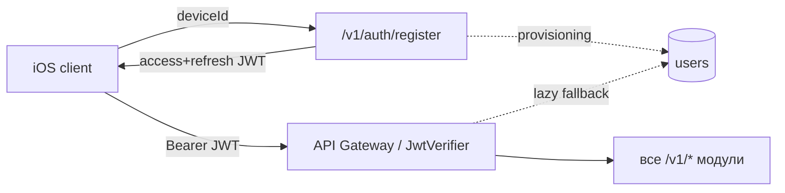

# Auth — Context

## Положение в системе
Auth — **точка входа** в систему: единственный контур, доступный **без** пользовательского JWT (это место его получения). Все прочие `/v1/*` требуют выпущенный здесь токен.

## Зависимости
- **API Gateway / `JwtVerifier`** (`src/app/api_gateway/auth.py`) — auth выпускает токены, которые верифицирует существующий verifier. Verifier **не меняется** (тот же RS256, `iss`/`aud`/`exp`/`sub`). Issuer и verifier разделяют одну ключевую пару из config.
- **`users` (provisioning, [ADR-007](../../adr/ADR-007-lazy-user-provisioning.md))** — `register` создаёт `users`-строку явно; lazy-provisioning в gateway остаётся fallback.
- **Config** (`src/app/config.py`) — ключи (`JWT_PRIVATE_KEY`/`_PATH`, `JWT_PUBLIC_KEY`/`_PATH`, `JWT_ISSUER`, `JWT_AUDIENCE`, `JWT_KID`), TTL (`AUTH_ACCESS_TTL_SECONDS`, `AUTH_REFRESH_TTL_SECONDS`), rate-limit (`AUTH_RATE_LIMIT_PER_IP`).
- **Rate-limiter (gateway, Redis)** — per-IP лимит на `/v1/auth/*`.

## Соседи, которых НЕ затрагивает
- **Admin-auth ([ADR-009](../../adr/ADR-009-admin-token-auth.md))** — полностью изолирована (другой секрет/заголовок/зависимость). Auth-модуль её не касается; роли `admin` в пользовательском JWT нет.
- **Preview signed URL ([ADR-010](../../adr/ADR-010-backend-hosted-preview.md))** — отдельный контур (HMAC в URL), не пересекается.
- **Billing/policy ([ADR-002](../../adr/ADR-002-access-policy-state-machine.md)/[ADR-006](../../adr/ADR-006-credit-billing-and-subscription-grant.md))** — видят нового пользователя так же, как при внешнем issuer (`trial_used=FALSE` по дефолту).

## Потоки
- **Первый запуск:** iOS → `register(deviceId?)` → backend create `userId`+`auth_devices`+provisioning → access+refresh.
- **Истечение access:** iOS → `refresh(refreshToken)` → новая пара (rotation).
- **Переустановка (refresh сохранён в Keychain):** `refresh` → та же идентичность. **Без** сохранённого refresh и того же `deviceId` → `register`/`token` вернёт тот же `userId` (устройство известно). Новый `deviceId` → новый `userId` (ограничение device-based, [ADR-018](../../adr/ADR-018-embedded-auth-issuer.md), [Q-018-2](../../99-open-questions.md)).
