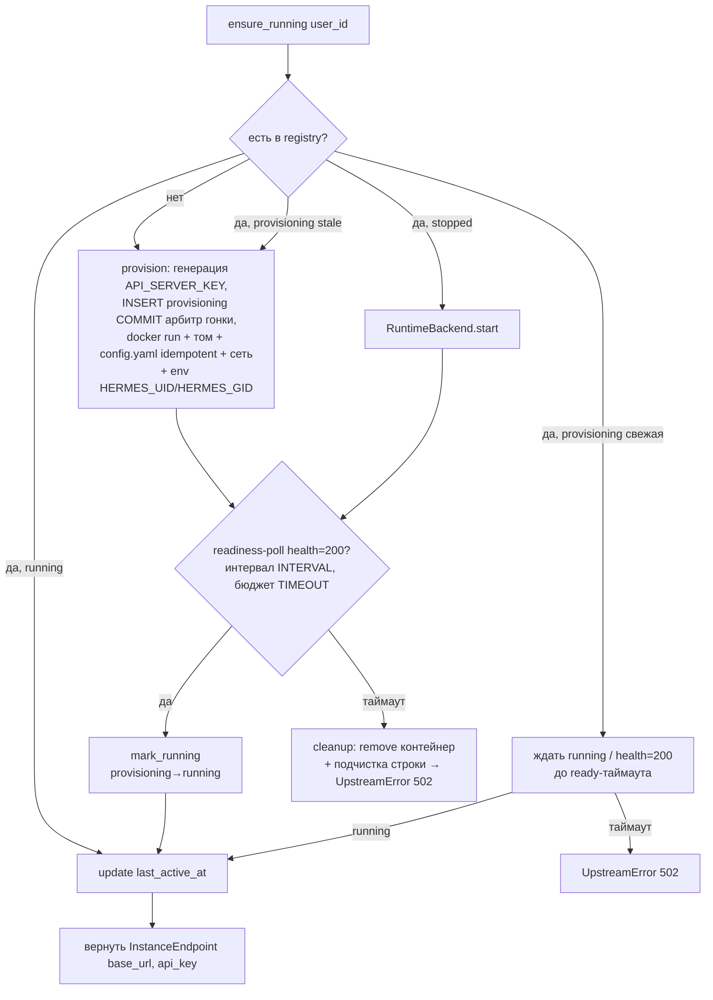

# Hermes Runtime — Architecture

## Состав (`src/app/hermes_runtime/`)
- `manager.py` — `HermesInstanceManager` (оркестрация жизненного цикла, [02-api-contracts.md](02-api-contracts.md)).
- `docker_backend.py` — `DockerBackend` (реализация `RuntimeBackend` на docker-py).
- `registry.py` — репозиторий поверх `hermes_instances` ([04-data-model.md](04-data-model.md)).
- `__init__.py` — экспорт.
- Wiring провайдера — `get_hermes_manager()` в `src/app/deps.py`.
- Reaper — задача в `lifespan` (`src/app/main.py`), вызывает `stop_idle`.

## Поток ensure_running ([ADR-056](../../adr/ADR-056-provision-readiness-gate-and-volume-ownership.md))

- **Readiness-gate ([ADR-056 §1](../../adr/ADR-056-provision-readiness-gate-and-volume-ownership.md)):** `mark_running` — строго ПОСЛЕ `health=200`. Poll в `_provision_locked` после `docker run` (cold-start образа ~30–40 с). Бюджет `HERMES_PROVISION_READY_TIMEOUT_SECONDS` (90с), интервал `HERMES_PROVISION_READY_INTERVAL_SECONDS` (2с), каждая проба под `HERMES_HEALTH_TIMEOUT_SECONDS`. Reuse `health(endpoint, api_key)` (Bearer).
- **Транзакционная корректность:** `provisioning`-строка коммитится ДО `docker run`+poll (арбитр гонки), `mark_running` — отдельный поздний commit. Это коротко-транзакционный паттерн (PK + `ON CONFLICT` + re-read), НЕ удержание row-lock через всю операцию — иначе lock освобождался бы commit'ом до ready (класс дефекта [ADR-054](../../adr/ADR-054-trial-claim-reconcile.md) MAJOR-4).
- **Конкурентный `ensure_running`** на свежей `provisioning` — ждёт `running`/`health=200` (не перепровижинит, не проксирует немедленно); cleanup при таймауте делает только владелец `_provision_locked`.
- **Владение томом ([ADR-056 §4](../../adr/ADR-056-provision-readiness-gate-and-volume-ownership.md)):** env `HERMES_UID`/`HERMES_GID`=uid/gid api (10001) → stage2 образа `chown /opt/data` на тот же uid → reuse-write `config.yaml` без `PermissionError`; idempotent-write (не перезаписывать валидный существующий `config.yaml`).

## Гибернация (reaper)
- Фоновая задача в `lifespan` периодически вызывает `stop_idle(HERMES_IDLE_TIMEOUT_SECONDS)`.
- `stop_idle` выбирает `status=running AND last_active_at < now()-threshold` (индекс `ix_hermes_instances_status_active`), останавливает контейнеры (`RuntimeBackend.stop`), `status=stopped`. Том сохраняется → пробуждение `ensure_running` восстанавливает память/навыки.
- Состояние в БД (не в памяти процесса) → reaper переживает рестарт `api`.

## Конфигурация LLM инстанса ([ADR-055](../../adr/ADR-055-hermes-instance-llm-config-contract.md))
- Модель/провайдер инстанса задаются ТОЛЬКО через `config.yaml` тома (`model.default`/`model.provider`[/`base_url`][/`api_key`]) — образ Hermes игнорирует env `LLM_MODEL` и резолвит провайдер из `config.yaml`. `_container_env` для провайдеров с env-ключом передаёт `API_SERVER_*` + `<PROVIDER>_API_KEY`; для провайдеров без env-ключа (`custom` ∈ `HERMES_PROVIDERS_CONFIG_API_KEY`, [ADR-055 §6](../../adr/ADR-055-hermes-instance-llm-config-contract.md)) — `API_SERVER_*` + `HERMES_INSTANCE_LLM_KEY` (без `<PROVIDER>_API_KEY` — образ его игнорирует).
- `render_instance_config(*, toolset, provider, model, base_url, api_key)` собирает `model.default="<provider>/<model>"` (control plane склеивает «голое» `HERMES_MODEL` с провайдером; для `custom` → `"custom/<model>"`) и `model.provider="<provider>"` (КОНКРЕТНЫЙ, НЕ `auto` — иначе дефолт openrouter base_url → 401). Для провайдеров без env-ключа доп. эмитит `model.api_key="${HERMES_INSTANCE_LLM_KEY}"` (env-ссылка — плейнтекст ключа НЕ пишется в файл тома; образ раскрывает `${}` при загрузке config). Значения `provider`/`model`/`base_url` валидируются к safe-charset; `api_key` эмитится как env-ссылка-константа (анти-инъекция YAML — содержимое ключа в YAML не подставляется).
- Провайдер — closed-set allowlist образа; `openai` невалиден (нет direct-провайдера → OpenAI через `openrouter`/`custom`), `auto` запрещён для провижининга. Невалидный провайдер / пустой `HERMES_MODEL` / отсутствующий обязательный `base_url` → fail-fast в `_require_provision_config` (`UpstreamError` до `docker run`), а не 401 в рантайме. Детали/таблица key-env — [02-api-contracts.md](02-api-contracts.md), [ADR-055](../../adr/ADR-055-hermes-instance-llm-config-contract.md).

## Расширяемость (`RuntimeBackend`)
- MVP — `DockerBackend` (docker-py). Будущие — Modal/Daytona (у Hermes есть `tools/environments/{modal,daytona}.py`) — подключаются в тот же интерфейс без правки `manager.py`/`registry.py`. Выбор бэкенда — config (резерв; MVP фиксирует docker).
- Паттерн — как `KmsClient` ([ADR-003](../../adr/ADR-003-byok-envelope-encryption.md)) / `LLMClient` ([ADR-033](../../adr/ADR-033-llm-provider-abstraction.md)).

## Безопасность
- Per-instance `API_SERVER_KEY` шифруется envelope-схемой через `byok.kms` ([ADR-003](../../adr/ADR-003-byok-envelope-encryption.md)); plaintext только in-memory на время прокси-вызова; redaction `*key*`. Изоляция контейнер+том, порт не на хост, ограниченный toolset — [05-security.md](05-security.md), [../../05-security.md §Multi-tenant изоляция](../../05-security.md#multi-tenant-изоляция-hermes-инстансов-adr-046-adr-045).

## Обработка отказов
- `provision` падает (Docker недоступен/образ не тянется) → ошибка наверх (Agent Proxy → `502`); строка `provisioning` подчищается/перепровижинится при следующем `ensure_running`.
- **Readiness-таймаут ([ADR-056 §1](../../adr/ADR-056-provision-readiness-gate-and-volume-ownership.md)):** контейнер поднят, но `api_server` не отдал `health=200` за `HERMES_PROVISION_READY_TIMEOUT_SECONDS` → `_provision_locked` делает cleanup (`RuntimeBackend.remove` + подчистка строки: НЕ оставлять `running` на неготовом контейнере, НЕ оставлять «вечную» `provisioning`) → `UpstreamError`/`502`. Том сохраняется (удаляется только контейнер); следующий `ensure_running` начинает провижининг заново.
- Контейнер существует в registry, но отсутствует в Docker (внешнее удаление) → `ensure_running` детектит при `start`/`health` и перепровижинит.
- **Stale `provisioning` по возрасту ([TD-031](../../100-known-tech-debt.md), prod-harden).** При краше процесса между `create_provisioning` и `mark_running` остаётся строка `provisioning` с `endpoint=NULL`/`container_id` без готового контейнера. `ensure_running` трактует строку `provisioning` **старше порога** `HERMES_PROVISIONING_STALE_SECONDS` (env, дефолт `120` сек) как stale → `deprovision`+`provision` (полный реплей), а не использует неполную строку (прежде → DNS-фолбэк → `502`). Свежая `provisioning`-строка (моложе порога) трактуется как живой конкурентный провижининг (текущее поведение). Реплей идемпотентен под тем же `user_id` PK (`provision` перезаписывает `container_id`/`endpoint`/`api_key_enc`). Контракт `/v1/agent/*` не меняется. **Реализовано и закрыто (2026-06-24, [TD-031](../../100-known-tech-debt.md) Закрыт)** — подтверждено тестами (симуляция краша между `create_provisioning` и `mark_running` → stale-реплей).
